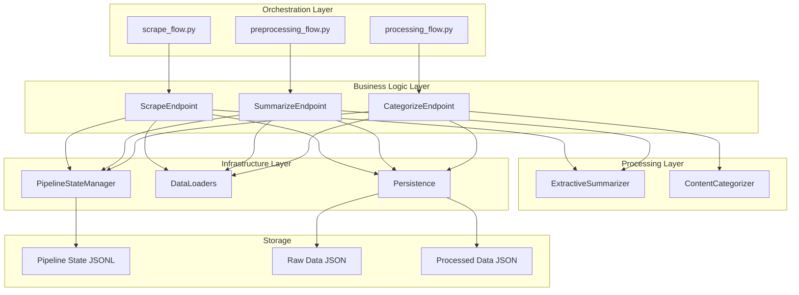
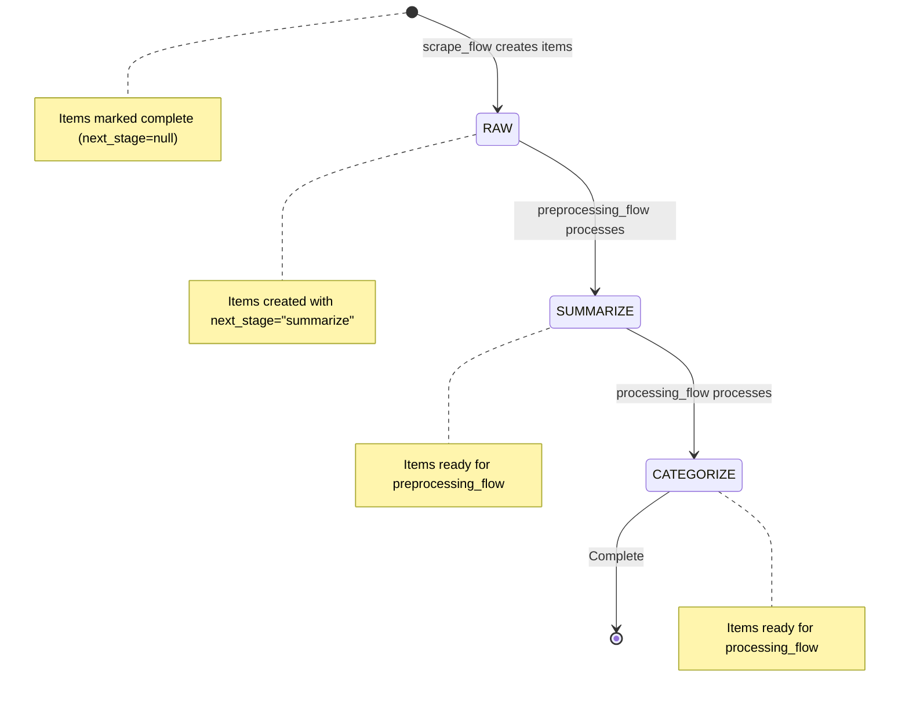
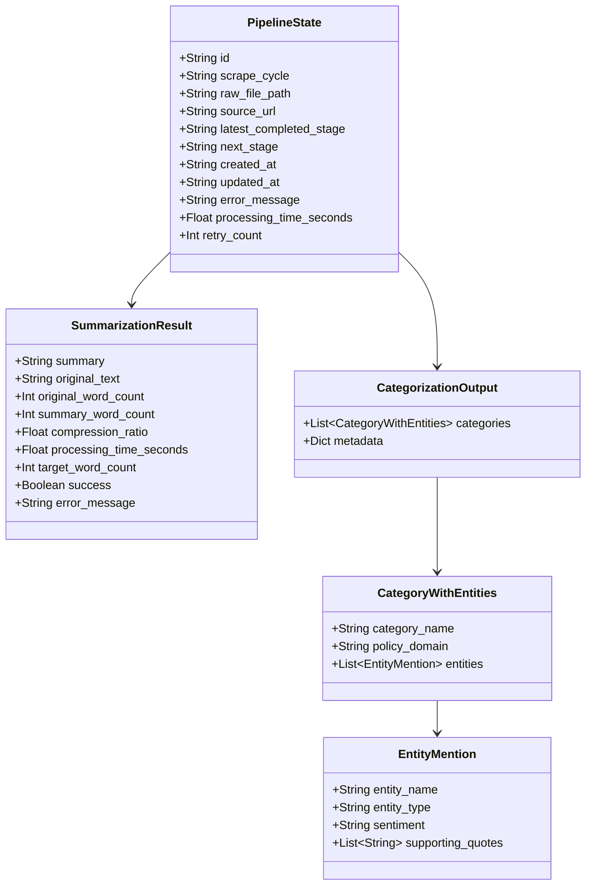
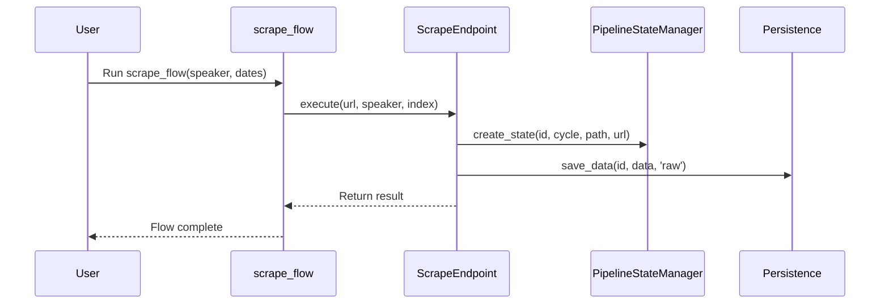

# KG-Sentiment Architecture

*Last Updated: January 15, 2025*

A knowledge graph sentiment analysis platform for processing political communications through independent Prefect flows.

## Component Summary

| Component Type | Count | Names |
|---|---|---|
| Flows | 3 | scrape_flow, preprocessing_flow, processing_flow |
| Endpoints | 3 | ScrapeEndpoint, SummarizeEndpoint, CategorizeEndpoint |
| Pipelines | 2 | preprocess_content, process_content |
| Processors | 2 | ExtractiveSummarizer, ContentCategorizer |
| Data Loaders | 2 | RawDataLoader, SummaryDataLoader |
| State Manager | 1 | PipelineStateManager |

## System Architecture Diagram



## Pipeline State Flow



## Data Model Class Diagram



## Sequence Diagram



## Data Flow & Integration

### Data Entry
- **scrape_flow** → generates mock URLs → **ScrapeEndpoint** → saves raw JSON → creates pipeline state with `next_stage="summarize"`

### Flow Orchestration
- **preprocessing_flow** → queries state for items with `next_stage="summarize"` → **SummarizeEndpoint** → processes through **ExtractiveSummarizer** → updates state to `next_stage="categorize"`
- **processing_flow** → queries state for items with `next_stage="categorize"` → **CategorizeEndpoint** → processes through **ContentCategorizer** → updates state to `next_stage=null` (complete)

### Data Transformations
- **Raw JSON** → **ExtractiveSummarizer** → **Summary JSON** (target: 1000 tokens)
- **Summary JSON** → **ContentCategorizer** → **Categorization JSON** (entities, sentiment, quotes)

### State Management
- **PipelineStateManager** tracks each item's progress through stages
- **JSONL format** enables independent flow execution and fault tolerance
- **State queries** allow flows to discover work without coordination

## Technology Stack

| Layer | Technology | Purpose |
|---|---|---|
| Orchestration | Prefect 3.0+ | Flow/task management, scheduling |
| Business Logic | Python Classes | Endpoint pattern for clean separation |
| Processing | SentenceTransformers, LangChain | Text summarization and categorization |
| Storage | JSON/JSONL | Lightweight, human-readable data persistence |
| State Management | Custom JSONL | Pipeline progress tracking |
| Logging | Custom Logger | Structured logging across components |

## Directory Structure

```
KG-Sentiment/
├── flows/                          # Prefect orchestration flows
│   ├── scrape_flow.py             # Data collection flow
│   ├── preprocessing_flow.py      # Summarization flow  
│   └── processing_flow.py         # Categorization flow
├── src/                           # Business logic layer
│   ├── collect/scrape_endpoint.py # Scraping business logic
│   ├── preprocessing/             # Summarization business logic
│   │   ├── summarize_endpoint.py
│   │   ├── pipeline.py
│   │   └── extractive_summarizer.py
│   └── processing/                # Categorization business logic
│       ├── categorize_endpoint.py
│       ├── pipeline.py
│       └── content_categorizer.py
├── tasks/                         # Infrastructure utilities
│   ├── orchestration.py          # Pipeline management
│   ├── data_loaders.py           # Data loading abstractions
│   └── persistence.py            # Data persistence utilities
├── src/shared/                    # Shared components
│   ├── pipeline_state.py         # State management
│   ├── logging_utils.py          # Logging utilities
│   └── config.py                 # Configuration
└── data/                         # Data storage
    ├── raw/                      # Raw transcript data
    ├── processed/                # Summaries and categorizations
    └── state/                    # Pipeline state tracking
```

## Key Design Patterns

1. **Endpoint Pattern**: Business logic encapsulated in endpoint classes, called by thin Prefect tasks
2. **Independent Flows**: Each flow runs independently, discovering work via state queries
3. **State-Driven Processing**: JSONL state tracking enables fault tolerance and independent execution
4. **Separation of Concerns**: Orchestration (flows) vs business logic (endpoints) vs infrastructure (tasks)
5. **Data Abstraction**: Clean data loaders hide file system complexity from business logic

## Data Flow Summary

- **scrape_flow** → discovers URLs → **ScrapeEndpoint** → saves raw data → creates state records
- **preprocessing_flow** → queries state → **SummarizeEndpoint** → **ExtractiveSummarizer** → saves summaries → updates state
- **processing_flow** → queries state → **CategorizeEndpoint** → **ContentCategorizer** → saves categorizations → marks complete
- **State Management** → tracks progress through `raw → summarize → categorize → complete`
- **Independent Execution** → flows can run on different schedules without coordination
