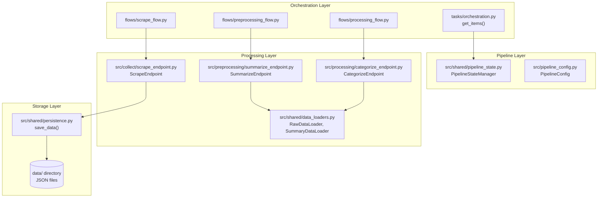
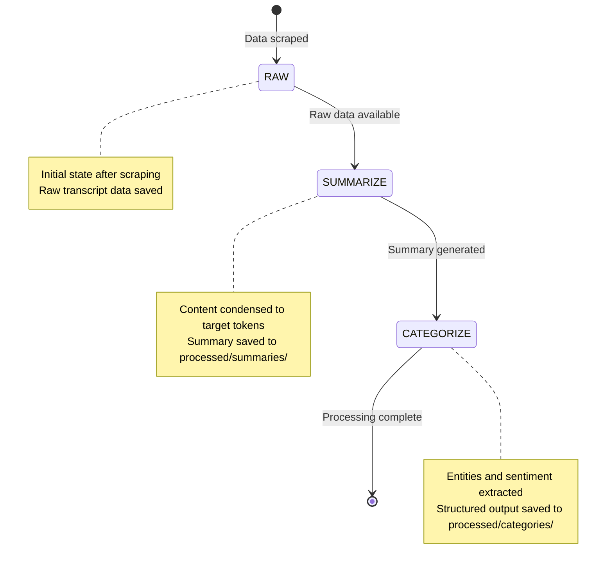
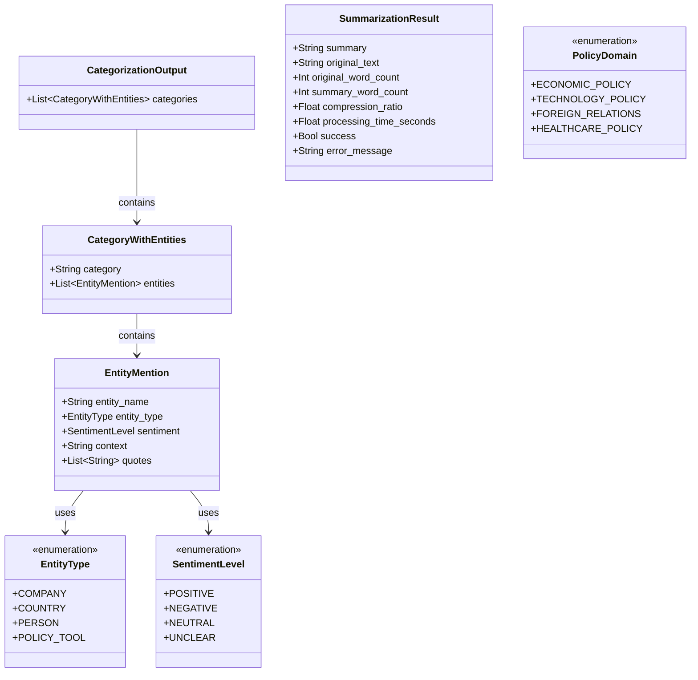
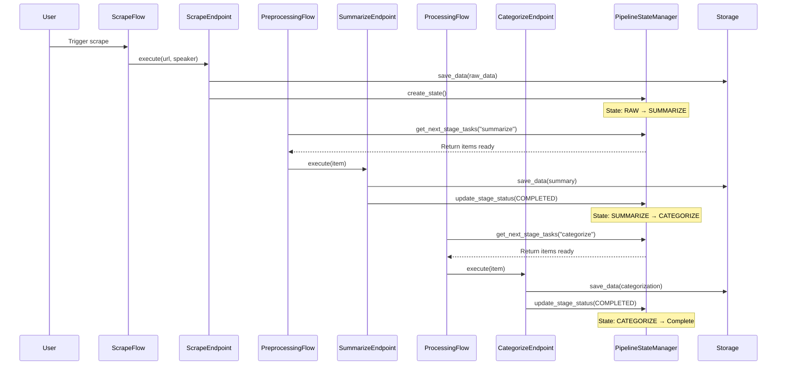

# KG-Sentiment Platform Architecture

## High-Level System Overview

The KG-Sentiment platform is a state-driven, multi-stage data processing pipeline designed to transform political communications into structured knowledge graphs. The core pattern follows a simple but powerful flow: `RAW → SUMMARIZE → CATEGORIZE → Complete`.

The system uses several key design patterns:
- **State-driven processing**: Every data point is tracked through pipeline stages
- **Endpoint pattern**: Each processing stage has dedicated endpoints for clean separation
- **Flow orchestration**: Prefect workflows coordinate the entire pipeline execution

## Project Structure

```
KG-Sentiment/
├── src/                    # Core application code
│   ├── shared/            # Shared utilities (state management, logging, data loaders)
│   ├── preprocessing/     # Summarization pipeline components
│   ├── processing/        # Categorization pipeline components
│   └── collect/           # Data collection endpoints
├── flows/                 # Prefect workflow orchestration
├── tasks/                 # Task utilities and orchestration
├── data/                  # Raw and processed data storage
│   ├── raw/               # Original scraped data
│   ├── processed/         # Summaries and categorizations
│   └── state/             # Pipeline state tracking
├── playground/            # Interactive testing notebooks
└── documentation/         # Architecture and requirements docs
```

## System Architecture

The platform is organized into four main layers that work together to process political communications:



## Pipeline Flow & State Management

The pipeline operates on a simple but effective state-driven model. Each data point progresses through three main stages: RAW (data collected), SUMMARIZE (content condensed), and CATEGORIZE (entities and sentiment extracted).

The `PipelineStateManager` tracks every item's journey through these stages, maintaining state in a JSONL file that enables reliable processing, failure recovery, and progress monitoring.

## Pipeline State Flow



## Data Models & Relationships

The platform uses a clean separation between domain models and infrastructure models. Domain models define the business logic for political communication analysis, while infrastructure models handle pipeline state and processing results.

The core domain models include `EntityMention` for individual entities, `CategoryWithEntities` for grouping, and `CategorizationOutput` for the complete analysis result. Processing results are captured in `SummarizationResult` with comprehensive metrics.

## Data Model Relationships



## Processing Components

Each stage of the pipeline has dedicated endpoints that encapsulate the processing logic. The `ScrapeEndpoint` handles data collection, `SummarizeEndpoint` manages content condensation using extractive summarization, and `CategorizeEndpoint` performs entity extraction and sentiment analysis using LangChain.

These endpoints work with specialized data loaders (`RawDataLoader`, `SummaryDataLoader`) to handle data access and validation, while the `save_data()` function provides consistent persistence across all stages.

## Component Interactions

```mermaid
graph LR
    subgraph "Data Collection"
        SCRAPE[ScrapeEndpoint.execute()]
        MOCK[tests/test_transcript_generator.py]
    end
    
    subgraph "Preprocessing"
        SUMMARIZE[SummarizeEndpoint.execute()]
        EXTRACT[ExtractiveSummarizer.summarize()]
        RAW_LOADER[RawDataLoader.load()]
    end
    
    subgraph "Processing"
        CATEGORIZE[CategorizeEndpoint.execute()]
        CONTENT[ContentCategorizer.categorize_content()]
        SUMMARY_LOADER[SummaryDataLoader.load()]
    end
    
    subgraph "Infrastructure"
        SAVE[save_data()]
        STATE_MGR[PipelineStateManager]
    end
    
    SCRAPE --> MOCK
    SCRAPE --> SAVE
    SUMMARIZE --> RAW_LOADER
    SUMMARIZE --> EXTRACT
    CATEGORIZE --> SUMMARY_LOADER
    CATEGORIZE --> CONTENT
    SAVE --> STATE_MGR
```

## Complete Workflow Example

A typical end-to-end processing flow begins when a user triggers the scrape flow, which discovers and collects political communications. The system then processes these through the summarization and categorization stages, with state management ensuring reliable progression and failure recovery.

Each stage updates the pipeline state upon completion, enabling the orchestration layer to identify items ready for the next processing stage.

## End-to-End Sequence Flow



## Technology & Patterns Summary

The platform leverages a modern Python stack with specialized libraries for each processing stage, ensuring both reliability and performance.

## Technology Stack

| Layer | Technology | Purpose |
|-------|------------|---------|
| **Orchestration** | Prefect | Workflow management and task coordination |
| **Processing** | LangChain | Structured AI output parsing and entity extraction |
| **Summarization** | SentenceTransformers | Semantic similarity for extractive summarization |
| **Data Models** | Pydantic | Type-safe data validation and serialization |
| **State Management** | JSONL files | Lightweight, reliable state persistence |
| **Configuration** | Python dataclasses | Clean configuration management |

## Key Design Patterns

1. **State-Driven Processing**: Every data point is tracked through pipeline stages for reliable processing and failure recovery.
2. **Endpoint Pattern**: Each processing stage has dedicated endpoints that encapsulate business logic and coordinate with infrastructure.
3. **Flow Orchestration**: Prefect workflows provide clean separation between orchestration and processing concerns.
4. **Pipeline Configuration**: Centralized stage definitions and flow logic enable easy modification and extension.
5. **Data Loader Pattern**: Specialized loaders handle data access, validation, and transformation for each pipeline stage.

The architecture emphasizes simplicity, reliability, and maintainability while providing a solid foundation for scaling to multi-speaker analysis and advanced relationship modeling.
