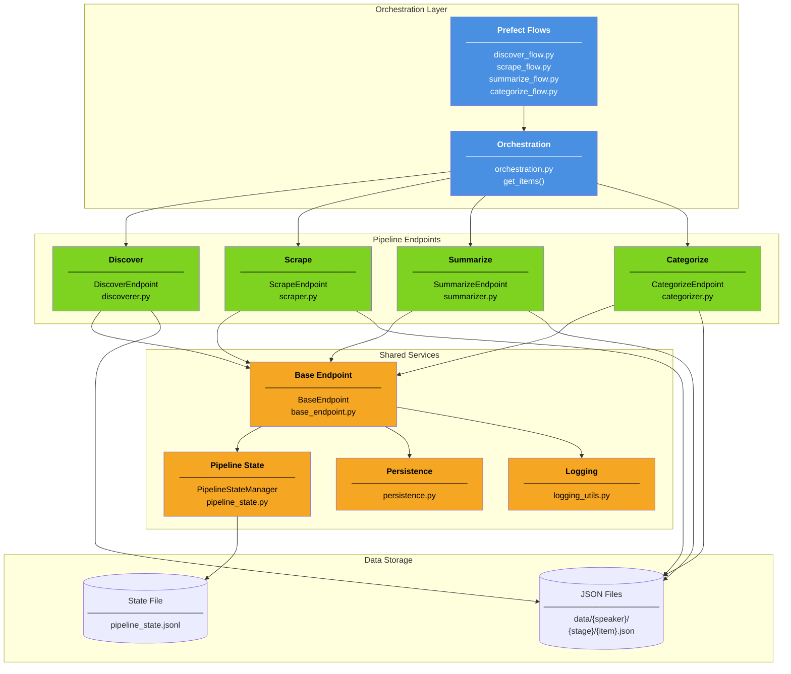
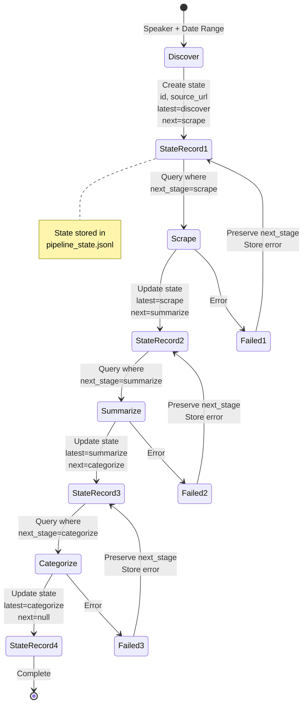
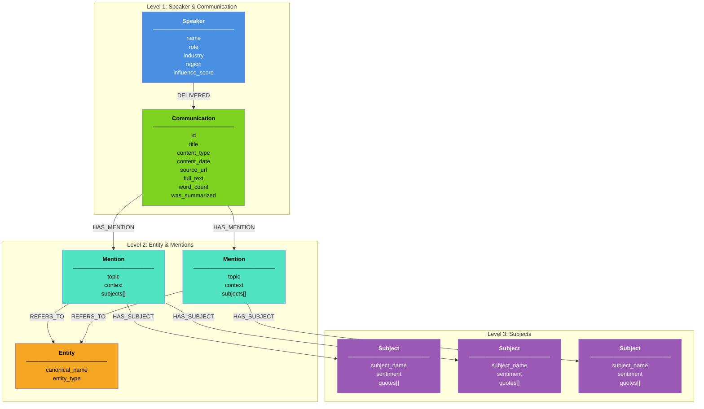

# DiscourseKG System Architecture

## High-Level Overview

DiscourseKG is a knowledge graph platform that transforms public communications from influential speakers into structured, queryable relationship data. The system processes raw content through a five-stage pipeline (discover → scrape → summarize → categorize → graph) with persistent state tracking, enabling retry logic and incremental updates. Built on Prefect for orchestration and LangChain for LLM-powered analysis, it produces Neo4j-ready data for complex relationship queries across speakers, entities, topics, and sentiment.

---

## System Architecture

The platform consists of four architectural layers: orchestration (Prefect flows), pipeline endpoints (stage-specific processors), shared services (state management and utilities), and data storage (JSON files and JSONL state tracking). Each layer is isolated, with endpoints inheriting from `BaseEndpoint` and all stages coordinated through `PipelineStateManager`.



**Key Components:**
- **Prefect Flows**: Workflow orchestration with task dependencies, retries, and error handling
- **Pipeline Endpoints**: Stage-specific processors (`DiscoverEndpoint`, `ScrapeEndpoint`, `SummarizeEndpoint`, `CategorizeEndpoint`)
- **Pipeline State Manager**: JSONL-based state tracking in `src/shared/pipeline_state.py`
- **Base Endpoint**: Abstract class providing standardized `execute()` interface
- **Persistence Layer**: File I/O utilities in `src/shared/persistence.py`

---

## Pipeline Flow & State Management

Items progress through five sequential stages: discover (find sources), scrape (extract transcripts), summarize (condense if needed), categorize (extract entities/topics), and graph (load to Neo4j). The `PipelineStateManager` tracks each item's progress in a JSONL file at `data/state/pipeline_state.jsonl`, storing the current stage, completed stages, file paths, and error messages.

**State Transitions:**
1. **Discover**: Creates initial state with `id`, `source_url`, `speaker` → sets `latest_completed_stage=discover`, `next_stage=scrape`
2. **Scrape**: Reads items where `next_stage=scrape` → processes → updates to `latest_completed_stage=scrape`, `next_stage=summarize`
3. **Summarize**: Reads items where `next_stage=summarize` → processes → updates to `latest_completed_stage=summarize`, `next_stage=categorize`
4. **Categorize**: Reads items where `next_stage=categorize` → processes → updates to `latest_completed_stage=categorize`, `next_stage=graph`
5. **Graph**: Reads items where `next_stage=graph` → loads to Neo4j → updates to `latest_completed_stage=graph`, `next_stage=null` (complete)

Failures preserve `next_stage` for retry and store `error_message` for debugging.



**State File Format (JSONL):**

Each line represents one item's complete state:

```json
{
  "id": "discovered-item-0-20251026_135658",
  "run_timestamp": "2025-10-26_13:00:00",
  "speaker": "test_speaker",
  "content_type": "speech",
  "source_url": "https://example.com/speech",
  "latest_completed_stage": "categorize",
  "next_stage": null,
  "file_paths": {
    "discover": "data/test_speaker/discover/discovered-item-0.json",
    "scrape": "data/test_speaker/scrape/speech/discovered-item-0.json",
    "summarize": "data/test_speaker/summarize/speech/discovered-item-0.json",
    "categorize": "data/test_speaker/categorize/speech/discovered-item-0.json"
  },
  "created_at": "2025-10-26T13:56:58",
  "updated_at": "2025-10-26T13:59:54",
  "processing_time_seconds": 27.3,
  "error_message": null
}
```

---

## Data Flow Example

This example traces a single item for `test_speaker` through all pipeline stages, showing data transformations and model relationships.

**Input**: `speaker="test_speaker"`, `start_date="2025-10-20"`, `end_date="2025-10-27"`

```mermaid
graph TB
    subgraph "1. Discover Stage"
        INPUT["<b>Input Parameters</b><br/>────────────────────<br/>speaker: test_speaker<br/>start_date: 2025-10-20<br/>end_date: 2025-10-27"]
        DPROC["<b>DiscoverEndpoint</b><br/>────────────────────<br/>execute(params)"]
        DOUT["<b>Output</b><br/>────────────────────<br/>id, source_url<br/>content_type, title<br/>content_date"]
    end
    
    subgraph "2. Scrape Stage"
        SLOAD["<b>Load from State</b><br/>────────────────────<br/>Query: next_stage=scrape"]
        SPROC["<b>ScrapeEndpoint</b><br/>────────────────────<br/>execute(item)"]
        SOUT["<b>Output</b><br/>────────────────────<br/>full_text<br/>word_count<br/>content_date"]
    end
    
    subgraph "3. Summarize Stage"
        SUMLOAD["<b>Load from State</b><br/>────────────────────<br/>Query: next_stage=summarize"]
        SUMPROC["<b>SummarizeEndpoint</b><br/>────────────────────<br/>execute(item)"]
        SUMOUT["<b>Output</b><br/>────────────────────<br/>summary or full_text<br/>was_summarized<br/>compression_ratio"]
    end
    
    subgraph "4. Categorize Stage"
        CATLOAD["<b>Load from State</b><br/>────────────────────<br/>Query: next_stage=categorize"]
        CATPROC["<b>CategorizeEndpoint</b><br/>────────────────────<br/>execute(item)"]
        CATOUT["<b>Output</b><br/>────────────────────<br/>CategorizationOutput<br/>entities[]"]
    end
    
    subgraph "Data Models"
        EM["<b>EntityMention</b><br/>────────────────────<br/>entity_name<br/>entity_type<br/>mentions[]"]
        TM["<b>TopicMention</b><br/>────────────────────<br/>topic<br/>context<br/>subjects[]"]
        SUB["<b>Subject</b><br/>────────────────────<br/>subject_name<br/>sentiment<br/>quotes[]"]
    end
    
    INPUT --> DPROC
    DPROC --> DOUT
    DOUT --> SLOAD
    SLOAD --> SPROC
    SPROC --> SOUT
    SOUT --> SUMLOAD
    SUMLOAD --> SUMPROC
    SUMPROC --> SUMOUT
    SUMOUT --> CATLOAD
    CATLOAD --> CATPROC
    CATPROC --> CATOUT
    
    CATOUT --> EM
    EM --> TM
    TM --> SUB
    
    style INPUT fill:#4A90E2,color:#fff
    style DPROC fill:#7ED321,color:#000
    style SPROC fill:#7ED321,color:#000
    style SUMPROC fill:#7ED321,color:#000
    style CATPROC fill:#7ED321,color:#000
    style EM fill:#F5A623,color:#000
    style TM fill:#F5A623,color:#000
    style SUB fill:#F5A623,color:#000
```



**Data Transformation Flow:**

| Stage | Input | Output | File Path |
|-------|-------|--------|-----------|
| **Discover** | `{speaker, start_date, end_date}` | `{id, source_url, content_type, title, content_date}` | `data/{speaker}/discover/{id}.json` |
| **Scrape** | `{id, source_url}` from state | `{full_text, word_count, content_date}` | `data/{speaker}/scrape/{content_type}/{id}.json` |
| **Summarize** | `{full_text}` from scrape file | `{summary/full_text, was_summarized, compression_ratio}` | `data/{speaker}/summarize/{content_type}/{id}.json` |
| **Categorize** | `{summary, title, content_date}` | `{entities: [EntityMention]}` with nested models | `data/{speaker}/categorize/{content_type}/{id}.json` |
| **Graph** | All previous stage files + speakers.json | Neo4j nodes and relationships | Neo4j database (no JSON output) |

**Model Relationships:**
- `CategorizationOutput` contains list of `EntityMention` (validated: unique entity names)
- `EntityMention` contains list of `TopicMention` (validated: unique topics per entity)
- `TopicMention` contains list of `Subject` (2-3 word names, sentiment, quotes)
- Models defined in `src/categorize/models.py` with Pydantic validation

---

## Knowledge Graph Topology

The categorization stage outputs structured data designed for Neo4j ingestion, following a hierarchical graph structure with 5 node types and 4 relationship types. This topology enables queries like "How does Trump discuss Bitcoin?" or "Show all entities with positive sentiment in Technology topics."



**Node Types:**

1. **Speaker**: One per unique speaker - stores `name`, `role`, `industry`, `region`, `influence_score`
2. **Communication**: One per transcript - stores `id`, `title`, `content_type`, `content_date`, `source_url`, `full_text`, `word_count`, `was_summarized`, `compression_ratio`
3. **Entity**: One per unique entity across all communications - stores `canonical_name`, `entity_type` (organization, location, person, program, product, event, other)
4. **Mention**: One per unique (communication, entity, topic) combination - stores `topic` (economics, technology, foreign_affairs, healthcare, energy, defense, social, regulation), `context`, `subjects[]`, `aggregated_sentiment` (computed in graph preprocessing stage)
5. **Subject**: Specific subject within a mention - stores `subject_name` (2-3 words), `sentiment` (positive, negative, neutral, unclear), `quotes` (1-6 verbatim excerpts)

**Relationship Types:**

- `DELIVERED`: Speaker → Communication (who delivered the communication)
- `HAS_MENTION`: Communication → Mention (what entities were discussed in what topics)
- `REFERS_TO`: Mention → Entity (which entity is mentioned)
- `HAS_SUBJECT`: Mention → Subject (specific subjects discussed about the entity)

**Query Examples Enabled by Topology:**

```cypher
// How does Trump discuss Bitcoin?
MATCH (s:Speaker {name: "Donald Trump"})-[:DELIVERED]->(c:Communication)
      -[:HAS_MENTION]->(m:Mention)-[:REFERS_TO]->(e:Entity {canonical_name: "Bitcoin"})
RETURN m.topic, m.context, m.subjects
```

```cypher
// Show all Technology entities with positive sentiment
MATCH (m:Mention {topic: "technology"})-[:HAS_SUBJECT]->(sub:Subject {sentiment: "positive"}),
      (m)-[:REFERS_TO]->(e:Entity)
RETURN DISTINCT e.canonical_name, e.entity_type
```

```cypher
// Track sentiment changes for China over time
MATCH (s:Speaker)-[:DELIVERED]->(c:Communication)-[:HAS_MENTION]->(m:Mention)
      -[:REFERS_TO]->(e:Entity {canonical_name: "China"})
RETURN c.content_date, m.topic, m.subjects
ORDER BY c.content_date
```

For complete topology specifications, see `documentation/kg/topology.md`.

---

## Technology Stack

| Component | Technology | Purpose |
|-----------|-----------|---------|
| **Workflow Orchestration** | Prefect 3.0+ | Task coordination, retry logic, parallel execution, scheduling |
| **Data Validation** | Pydantic 2.0+ | Strict schema enforcement, type validation, nested model relationships |
| **LLM Framework** | LangChain + LangChain-OpenAI | Prompt management, structured output parsing, LLM interactions |
| **State Management** | JSONL files | Append-only state tracking, easy debugging, human-readable |
| **Data Storage** | JSON files | Stage output persistence, organized by speaker/stage/type |
| **Graph Database** | Neo4j (planned) | Relationship queries, graph traversal, pattern matching |
| **Logging** | Python logging + custom utilities | Stage-specific logs, debug tracing, error tracking |
| **Configuration** | Python Enums + Pydantic | Type-safe config, stage definitions, pipeline flow |
| **Testing** | Pytest | Unit tests, integration tests, synthetic data generation |
| **Environment** | python-dotenv | API key management, environment-specific config |

**Key Libraries:**
- **langchain-core**: Base abstractions for LLM chains and prompts
- **langchain-openai**: OpenAI API integration with structured output
- **tiktoken**: Token counting for summarization decisions
- **pyyaml**: YAML-based prompt template management
- **pyprojroot**: Cross-platform project root path resolution
- **tqdm**: Progress bars for batch processing

---

## Project Directory Structure

```
DiscourseKG/
│
├── src/                                  # Core application code
│   ├── app_config.py                    # Application-wide configuration (paths, settings)
│   ├── pipeline_config.py               # Pipeline stage definitions and flow (PipelineStages enum)
│   │
│   ├── discover/                         # Stage 1: Content discovery
│   │   ├── discover_endpoint.py         # DiscoverEndpoint class (inherits BaseEndpoint)
│   │   ├── discoverer.py                # Discovery logic implementation
│   │   └── pipeline.py                  # Discovery-specific pipeline utilities
│   │
│   ├── scrape/                           # Stage 2: Content scraping
│   │   ├── scrape_endpoint.py           # ScrapeEndpoint class (inherits BaseEndpoint)
│   │   ├── scraper.py                   # Web scraping logic implementation
│   │   ├── models.py                    # Scrape-specific Pydantic models
│   │   └── pipeline.py                  # Scrape-specific pipeline utilities
│   │
│   ├── summarize/                        # Stage 3: Content summarization
│   │   ├── summarize_endpoint.py        # SummarizeEndpoint class (inherits BaseEndpoint)
│   │   ├── summarizer.py                # LLM-powered summarization logic
│   │   ├── models.py                    # Summarize-specific Pydantic models
│   │   └── pipeline.py                  # Summarize-specific pipeline utilities
│   │
│   ├── categorize/                       # Stage 4: Entity/topic categorization
│   │   ├── categorize_endpoint.py       # CategorizeEndpoint class (inherits BaseEndpoint)
│   │   ├── categorizer.py               # LLM-powered categorization logic
│   │   ├── models.py                    # Entity, Topic, Subject Pydantic models
│   │   ├── pipeline.py                  # Categorize-specific pipeline utilities
│   │   └── prompts/                     # LLM prompt templates
│   │       └── categorization.yaml      # Structured prompt for entity extraction
│   │
│   ├── shared/                           # Shared utilities across all stages
│   │   ├── base_endpoint.py             # BaseEndpoint abstract class (execute interface)
│   │   ├── pipeline_state.py            # PipelineStateManager (JSONL state tracking)
│   │   ├── persistence.py               # File I/O utilities for JSON storage
│   │   ├── flow_processor.py            # Reusable flow processing patterns
│   │   └── data_loaders.py              # Data loading utilities
│   │
│   ├── speakers/                         # Speaker metadata models
│   │   └── models.py                    # Speaker Pydantic models
│   │
│   └── utils/                            # Cross-cutting utilities
│       └── logging_utils.py             # Logging configuration and helpers
│
├── flows/                                # Prefect flow definitions (orchestration)
│   ├── discover_flow.py                 # Discovery workflow
│   ├── scrape_flow.py                   # Scraping workflow
│   ├── summarize_flow.py                # Summarization workflow
│   └── categorize_flow.py               # Categorization workflow
│
├── tasks/                                # Orchestration tasks
│   └── orchestration.py                 # get_items() for stage coordination
│
├── tests/                                # Test suite
│   ├── transcript_generator.py          # Synthetic test data generation
│   └── transcript_templates.json        # Test templates for speeches/debates/interviews
│
├── documentation/                        # Project documentation
│   ├── brd.md                           # Business Requirements Document
│   ├── architecture.md                  # This file - system architecture
│   └── kg/                              # Knowledge graph documentation
│       └── topology.md                  # Graph structure and node/relationship specs
│
├── scripts/                              # Setup and utility scripts
│   └── setup_env.sh                     # Environment setup script
│
├── pyproject.toml                        # Python project dependencies
├── Makefile                              # Common development commands
└── README.md                             # Project overview
```

---

## Design Principles

1. **Stateful Pipeline Architecture**: Items progress independently through stages; JSONL state file enables retry logic, failure recovery, and incremental processing without blocking on individual failures

2. **Stage Independence**: Each stage reads from previous stage's output file, processes independently, and writes new output—no shared memory between stages, enabling parallel processing and isolated debugging

3. **Validation at Boundaries**: Pydantic models enforce strict validation at input/output of every stage, catching errors early and ensuring data quality throughout the pipeline

4. **Observable Execution**: JSON outputs and JSONL state file provide human-readable inspection of pipeline progress, making debugging straightforward and enabling easy manual intervention

5. **Fail-Safe Processing**: Failed items preserve `next_stage` for retry and store detailed `error_message`; pipeline continues processing other items without blocking on failures

6. **Extensible by Design**: Adding new stages requires only: endpoint class (inherit `BaseEndpoint`), flow definition, state flow update—no changes to core state management or orchestration logic

7. **LLM-Powered Extraction with Schema Enforcement**: Categorization uses structured prompts with Pydantic schema enforcement, ensuring reliable entity/topic extraction with validation at the LLM output boundary

---

**Last Updated**: October 28, 2025  
**Document Version**: 2.0

