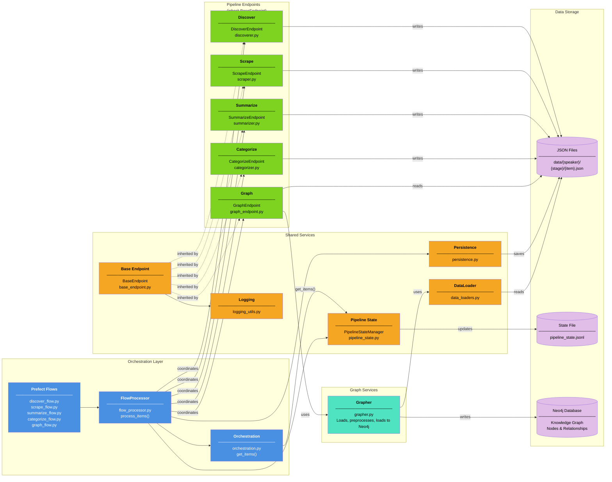
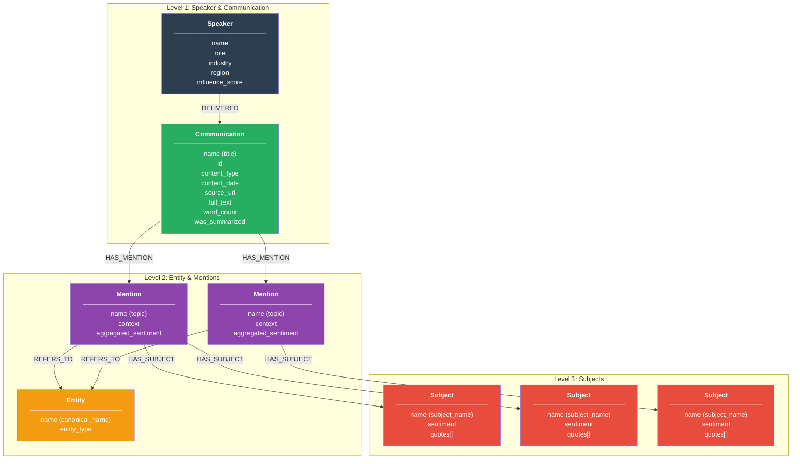

```mermaid
graph LR
    subgraph INPUT["Input"]
        SPEAKER["<b>Speaker<br/>Communications</b>"]
    end
    
    subgraph STAGES["Processing Pipeline"]
        DISC["<b>1. Discover</b><br/>────────────────────<br/>Find sources"]
        SCRP["<b>2. Scrape</b><br/>────────────────────<br/>Extract transcripts"]
        SUMM["<b>3. Summarize</b><br/>────────────────────<br/>Condense if needed"]
        CAT["<b>4. Categorize</b><br/>────────────────────<br/>Extract entities/topics"]
        GRAPH["<b>5. Graph</b><br/>────────────────────<br/>Load to Neo4j"]
    end
    
    subgraph OUTPUT["Output"]
        KG["<b>Knowledge Graph</b><br/>────────────────────<br/>Queryable relationships"]
    end
    
    SPEAKER -->|"Process"| DISC
    DISC --> SCRP
    SCRP --> SUMM
    SUMM --> CAT
    CAT --> GRAPH
    GRAPH --> KG
    
    style SPEAKER fill:#4A90E2,color:#fff
    style DISC fill:#7ED321,color:#000
    style SCRP fill:#7ED321,color:#000
    style SUMM fill:#7ED321,color:#000
    style CAT fill:#7ED321,color:#000
    style GRAPH fill:#7ED321,color:#000
    style KG fill:#F5A623,color:#000
```

# DiscourseKG System Architecture

## High-Level Overview

DiscourseKG transforms public communications from influential speakers into a queryable knowledge graph. The system processes content through five sequential stages with persistent state tracking for fault tolerance and incremental updates. Built on Prefect for orchestration, LangChain for LLM analysis, and Neo4j for graph storage, it extracts and maps relationships across speakers, entities, topics, and sentiment.



---

## System Architecture

<table>
<tr style="background-color: #fff; color: #000;">
<th>Entity</th>
<th>Job</th>
<th>Why</th>
</tr>
<tr style="background-color: #4A90E2; color: #fff;">
<td><strong>Prefect Flows</strong></td>
<td>Define workflow tasks with dependencies, retries, and error handling via @flow and @task decorators</td>
<td>Ensures reliable execution, automatic recovery from failures, and observable execution history</td>
</tr>
<tr style="background-color: #4A90E2; color: #fff;">
<td><strong>FlowProcessor</strong></td>
<td>Centralizes flow processing patterns (item iteration, error handling, timing, state updates)</td>
<td>Eliminates code duplication across pipeline flows and ensures consistent behavior</td>
</tr>
<tr style="background-color: #4A90E2; color: #fff;">
<td><strong>Orchestration</strong></td>
<td>Queries pipeline state to find items ready for each stage via get_items()</td>
<td>Coordinates which items move to which stage without manual intervention</td>
</tr>
<tr style="background-color: #7ED321; color: #000;">
<td><strong>Pipeline Endpoints</strong></td>
<td>Execute stage-specific processing logic (discover sources, extract text, summarize, categorize, load to Neo4j)</td>
<td>Each stage has unique requirements but shares common execution patterns via BaseEndpoint</td>
</tr>
<tr style="background-color: #50E3C2; color: #000;">
<td><strong>Grapher</strong></td>
<td>Loads and stitches data from multiple stages, preprocesses (sentiment aggregation, validation), and loads to Neo4j</td>
<td>Unified component that handles complete graph pipeline from data assembly to Neo4j ingestion</td>
</tr>
<tr style="background-color: #F5A623; color: #000;">
<td><strong>BaseEndpoint</strong></td>
<td>Provides standardized execute() interface and response formatting that all endpoints inherit</td>
<td>Ensures consistent behavior across all stages and reduces code duplication</td>
</tr>
<tr style="background-color: #F5A623; color: #000;">
<td><strong>PipelineStateManager</strong></td>
<td>Tracks each item's progress through stages in a JSONL state file with file paths, errors, and retry counts</td>
<td>Enables retry logic, failure recovery, and incremental processing without blocking on individual failures</td>
</tr>
<tr style="background-color: #F5A623; color: #000;">
<td><strong>Persistence</strong></td>
<td>Handles file I/O for saving JSON stage outputs with consistent file path structure</td>
<td>Decouples business logic from file system operations and ensures consistent data organization</td>
</tr>
<tr style="background-color: #F5A623; color: #000;">
<td><strong>DataLoader</strong></td>
<td>Loads JSON data from file paths (supports relative and absolute paths)</td>
<td>Centralizes data loading logic with consistent error handling and path resolution</td>
</tr>
<tr style="background-color: #E1BEE7; color: #000;">
<td><strong>Data Storage</strong></td>
<td>Persists stage outputs (JSON files), tracks pipeline state (JSONL), and stores knowledge graph in Neo4j</td>
<td>Enables inspection, debugging, resumable processing, and queryable relationship data</td>
</tr>
</table>



---

## Pipeline Flow & State Management

Items progress through five sequential stages: discover (find sources), scrape (extract transcripts), summarize (condense if needed), categorize (extract entities/topics), and graph (load to Neo4j). Each stage is orchestrated by Prefect flows that use the `FlowProcessor` pattern for consistent item handling, error management, and state updates.

The `PipelineStateManager` tracks each item's progress in a JSONL file at `data/state/pipeline_state.jsonl`, storing:
- Core identifiers (id, run_timestamp)
- Content metadata (speaker, content_type, title, content_date, source_url)
- Stage tracking (latest_completed_stage, next_stage)
- File paths for each completed stage
- Error messages and failed outputs for retry context
- Processing metrics (processing_time_seconds, retry_count)

Flows query the state manager via `get_items(stage)` to find items ready for processing, then use `FlowProcessor.process_items()` to iterate through items with automatic timing, persistence, and state updates.

```mermaid
graph LR
    subgraph INPUT["Input"]
        PARAMS["<b>Input Parameters</b><br/>────────────────────<br/>speaker: speaker name<br/>start_date: date range start<br/>end_date: date range end"]
    end
    
    subgraph STAGE1["1. Discover"]
        STATE1["<b>PipelineState</b><br/>────────────────────<br/>id: unique identifier<br/>speaker: speaker name<br/>source_url: content URL<br/>content_type: speech/debate/etc<br/>title: content title<br/>content_date: publication date<br/>────────────────────<br/>latest_completed: discover<br/>next_stage: scrape<br/>────────────────────<br/>file_paths: dict<br/>  • discover: output file path"]
        DISCOVER["<b>DiscoverEndpoint</b><br/>────────────────────<br/>execute(params)"]
    end
    
    subgraph STAGE2["2. Scrape"]
        STATE2["<b>PipelineState</b><br/>────────────────────<br/>id: unique identifier<br/>speaker: speaker name<br/>source_url: content URL<br/>content_type: speech/debate/etc<br/>title: content title<br/>content_date: publication date<br/>────────────────────<br/>latest_completed: scrape<br/>next_stage: summarize<br/>────────────────────<br/>file_paths: dict<br/>  • discover: output file<br/>  • scrape: output file"]
        SCRAPE["<b>ScrapeEndpoint</b><br/>────────────────────<br/>execute(state)"]
        SCRAPE_OUT["<b>ScrapingData</b><br/>────────────────────<br/>scrape: extracted transcript<br/>word_count: total word count<br/>title: content title<br/>content_date: publication date<br/>content_type: speech/debate/etc"]
    end
    
    subgraph STAGE3["3. Summarize"]
        STATE3["<b>PipelineState</b><br/>────────────────────<br/>id: unique identifier<br/>speaker: speaker name<br/>────────────────────<br/>latest_completed: summarize<br/>next_stage: categorize<br/>────────────────────<br/>file_paths: dict<br/>  • discover: output file<br/>  • scrape: output file<br/>  • summarize: output file"]
        SUMMARIZE["<b>SummarizeEndpoint</b><br/>────────────────────<br/>execute(state)"]
        SUM_OUT["<b>Summarize Output</b><br/>────────────────────<br/>summary: condensed or original text<br/>was_summarized: true if compressed<br/>compression_ratio: size reduction ratio"]
    end
    
    subgraph STAGE4["4. Categorize"]
        STATE4["<b>PipelineState</b><br/>────────────────────<br/>id: unique identifier<br/>────────────────────<br/>latest_completed: categorize<br/>next_stage: graph<br/>────────────────────<br/>file_paths: dict<br/>  • discover: output file<br/>  • scrape: output file<br/>  • summarize: output file<br/>  • categorize: output file"]
        CATEGORIZE["<b>CategorizeEndpoint</b><br/>────────────────────<br/>execute(state)"]
        CAT_OUT["<b>CategorizationOutput</b><br/>────────────────────<br/>entities: EntityMention[]<br/>  • entity_name: canonical name<br/>  • entity_type: organization/person/etc<br/>  • mentions: TopicMention[]<br/>    - topic: TopicCategory<br/>    - context: summary<br/>    - subjects: Subject[]"]
    end
    
    subgraph STAGE5["5. Graph"]
        STATE5["<b>PipelineState</b><br/>────────────────────<br/>id: unique identifier<br/>────────────────────<br/>latest_completed: graph<br/>next_stage: null (complete)<br/>────────────────────<br/>file_paths: dict<br/>  • discover: output file<br/>  • scrape: output file<br/>  • summarize: output file<br/>  • categorize: output file"]
        GRAPH["<b>GraphEndpoint</b><br/>────────────────────<br/>execute(state)"]
        GRAPHER["<b>Grapher</b><br/>────────────────────<br/>grapher.py<br/>Loads, preprocesses, & loads to Neo4j"]
        NEO4J[("Neo4j Database<br/>────────────────────<br/>Nodes & Relationships")]
    end
    
    PARAMS -->|"Input"| DISCOVER
    DISCOVER -->|"Creates"| STATE1
    
    STATE1 -->|"Query: next_stage='scrape'"| SCRAPE
    SCRAPE -->|"Reads scrape file"| SCRAPE_OUT
    SCRAPE -->|"Updates state"| STATE2
    
    STATE2 -->|"Query: next_stage='summarize'"| SUMMARIZE
    SUMMARIZE -->|"Reads scrape file"| SUM_OUT
    SUMMARIZE -->|"Updates state"| STATE3
    
    STATE3 -->|"Query: next_stage='categorize'"| CATEGORIZE
    CATEGORIZE -->|"Reads summarize file"| CAT_OUT
    CATEGORIZE -->|"Updates state"| STATE4
    
    STATE4 -->|"Query: next_stage='graph'"| GRAPH
    GRAPH -->|"Reads categorize/scrape/<br/>summarize files"| GRAPHER
    GRAPHER -->|"Preprocesses & loads"| NEO4J
    GRAPH -->|"Updates state"| STATE5
    
    style PARAMS fill:#4A90E2,color:#fff
    style STATE1 fill:#E8F4F8,color:#000
    style STATE2 fill:#E8F4F8,color:#000
    style STATE3 fill:#E8F4F8,color:#000
    style STATE4 fill:#E8F4F8,color:#000
    style STATE5 fill:#E8F4F8,color:#000
    style DISCOVER fill:#7ED321,color:#000
    style SCRAPE fill:#7ED321,color:#000
    style SUMMARIZE fill:#7ED321,color:#000
    style CATEGORIZE fill:#7ED321,color:#000
    style GRAPH fill:#7ED321,color:#000
    style GRAPHER fill:#50E3C2,color:#000
    style SCRAPE_OUT fill:#FFF9E6,color:#000
    style SUM_OUT fill:#FFF9E6,color:#000
    style CAT_OUT fill:#FFF9E6,color:#000
    style NEO4J fill:#F5A623,color:#000
```



---

## Key Design Patterns

### FlowProcessor Pattern
Eliminates code duplication across pipeline flows by centralizing common processing logic:
- Item iteration and coordination
- Error handling with automatic state updates on failure
- Timing and performance metrics
- Result persistence via `save_data()`
- Pipeline state updates via `PipelineStateManager`
- Metadata extraction and natural state updates

Each flow (except discover) uses `FlowProcessor.process_items(stage, task_func, data_type)` to process all items for a stage.

### BaseEndpoint Pattern
All pipeline endpoints inherit from `BaseEndpoint` to ensure consistent behavior:
- Standardized `execute(item)` interface
- Consistent response structure with `_create_success_response()`
- Stage-specific logging setup

### StageResult Separation
Endpoints return `StageResult` with separated concerns:
- `artifact`: Data to persist as stage output file (discoverer output, scraped text, etc.)
- `metadata`: Pipeline state updates only (content_type, title, etc.)

This separation ensures file outputs remain clean while allowing natural metadata accumulation in pipeline state.

### Context Manager Pattern for Neo4j
`Grapher` uses context manager for clean resource management:
- Automatic connection establishment on `__enter__`
- Automatic cleanup on `__exit__`
- Prevents connection leaks

### Error Handling Strategy
Multi-level error handling for resilience:
- **Prefect Task Level**: Automatic retries with exponential backoff (`retries=2, retry_delay_seconds=10`)
- **FlowProcessor Level**: Catches exceptions, stores error context in pipeline state, continues with next items
- **State Tracking**: Failed items keep `next_stage` unchanged for manual retry or debugging
- **Error Context**: Stores `error_message` and `failed_output` for debugging and retry optimization

---

## Knowledge Graph Topology

The categorization stage extracts entities with hierarchical structure: `EntityMention` contains multiple `TopicMention` (one per topic), each containing multiple `Subject` (specific aspects discussed). The graph stage uses `Grapher` to load data from multiple stages, stitch communication metadata, preprocess entities (computing aggregated sentiment from subjects, validating structure), and load into Neo4j. The resulting graph follows a hierarchical structure with 5 node types and 4 relationship types, enabling queries like "How does Trump discuss Bitcoin?" or "Show all entities with positive sentiment in Technology topics."

**Node Types:**
- **Speaker**: Influential figures with `name_id`, `display_name`, `role`, `organization`, `industry`, `region`
- **Communication**: Speeches, interviews, debates with `title`, `content_type`, `content_date`, `source_url`, `full_text`, `word_count`, `was_summarized`, `compression_ratio`
- **Entity**: Canonical entities (`canonical_name`, `entity_type`) mentioned across communications - types include organization, location, person, program, product, event, other
- **Mention**: Entity references within a specific topic context (`topic`, `context`, `aggregated_sentiment`) - topics include economics, technology, foreign_affairs, healthcare, energy, defense, social, regulation, other
- **Subject**: Specific aspects discussed about an entity (`subject_name`, `sentiment`, `quotes[]`) with sentiment values: positive, negative, neutral, unclear

All nodes include a `name` property for zero-config visualization in Neo4j Browser and Bloom.



**Relationship Types:**

- `DELIVERED`: Speaker → Communication (who delivered the communication)
- `HAS_MENTION`: Communication → Mention (what entities were discussed in what topics)
- `REFERS_TO`: Mention → Entity (which entity is mentioned)
- `HAS_SUBJECT`: Mention → Subject (specific subjects discussed about the entity)

**Aggregated Sentiment:**

The `Grapher` computes aggregated sentiment for each Mention during preprocessing by analyzing sentiment across all its Subjects:

```json
{
  "positive": {"count": 3, "prop": 0.6},
  "negative": {"count": 1, "prop": 0.2},
  "neutral": {"count": 1, "prop": 0.2}
}
```

Proportions are rounded to 3 decimal places (configurable via `graph_config.DECIMAL_PRECISION`). This enables topic-level sentiment queries without traversing to individual subjects.

---

## Data Flow

### File Organization
```
data/
├── state/
│   └── pipeline_state_{env}.jsonl    # Pipeline state tracking
└── {env}/                             # e.g., "test" or "prod"
    ├── speakers.json                  # Speaker configuration
    └── {speaker}/                     # e.g., "test_speaker"
        ├── discover/
        │   └── {content_type}/
        │       └── {id}.json          # Discovered items with metadata
        ├── scrape/
        │   └── {content_type}/
        │       └── {id}.json          # ScrapingData with scrape text
        ├── summarize/
        │   └── {content_type}/
        │       └── {id}.json          # Summaries with compression metrics
        ├── categorize/
        │   └── {content_type}/
        │       └── {id}.json          # EntityMention[] with hierarchical structure
        └── graph/
            └── {content_type}/
                └── {id}.json          # Graph loading results
```

### Stage Data Flow

1. **Discover Stage**: Creates initial pipeline state entries and discover output files
2. **Scrape Stage**: Reads discover output via DataLoader, extracts transcripts, saves `ScrapingData` with scrape text, word_count, title, content_date, content_type
3. **Summarize Stage**: Reads scrape output, conditionally summarizes, saves summarize output with compression metrics
4. **Categorize Stage**: Reads summarize output, extracts hierarchical entities via LLM (`EntityMention` → `TopicMention` → `Subject`), saves categorize output
5. **Graph Stage**: Reads all previous outputs, stitches communication metadata, preprocesses entities (computes aggregated sentiment), validates structure, and loads to Neo4j via Grapher

Each stage returns `StageResult` with separated `artifact` (persisted data) and `metadata` (state updates), advancing `next_stage` on success.

---

## Speaker Configuration

Speakers are configured in `data/speakers.json` with attributes that become Speaker node properties:

```json
{
  "name": "donald_trump",
  "display_name": "Donald Trump",
  "role": "US President",
  "organization": "US Government",
  "industry": "Politics",
  "region": "United States"
}
```

The discovery stage uses speaker configuration to find relevant content sources.

