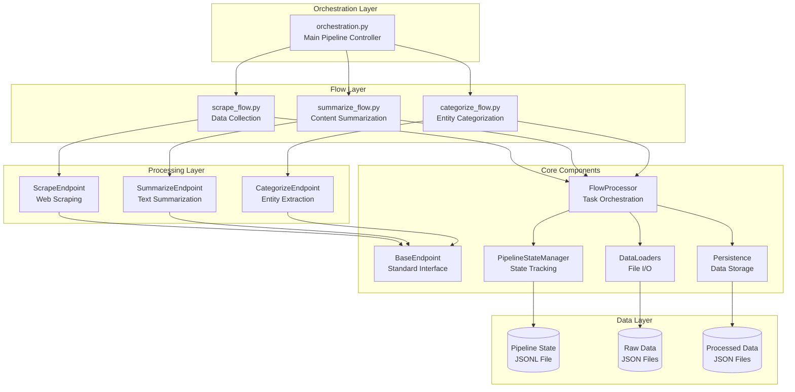
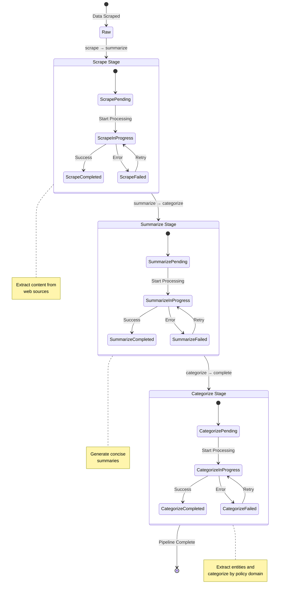
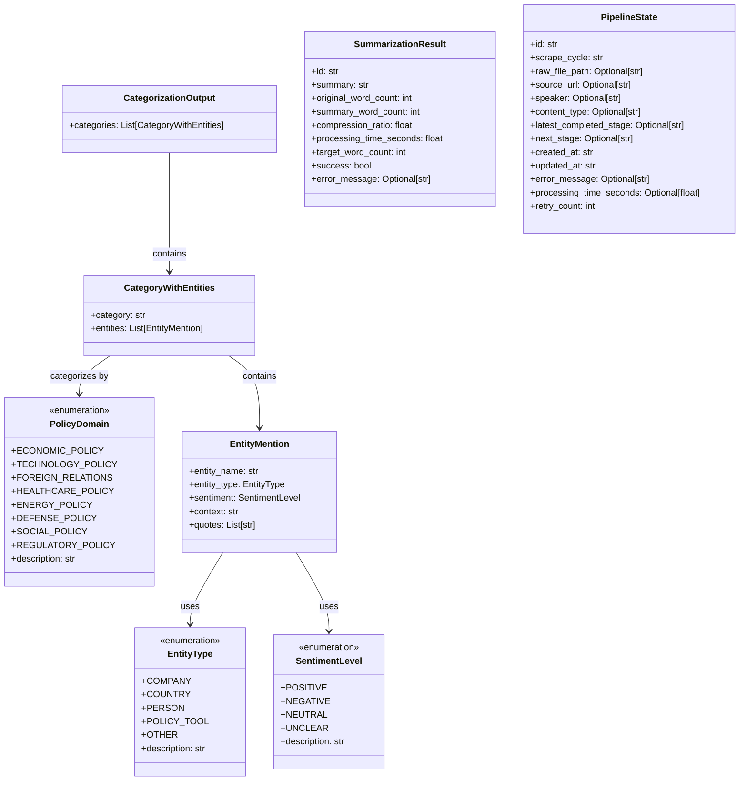

# KG-Sentiment Platform Architecture

## High-Level System Overview

The KG-Sentiment platform is a state-driven, multi-stage data processing pipeline designed for political communication analysis. The system processes political transcripts through three sequential stages: scraping, summarization, and categorization, with each stage building upon the previous one's output.

The core architecture follows a **state-driven processing pattern** where each data item maintains its processing state throughout the pipeline. This enables robust error handling, retry mechanisms, and the ability to resume processing from any point. The system uses **endpoint pattern** for consistent processing interfaces and **flow orchestration** with Prefect for managing complex workflows.



## Pipeline Flow & State Management

The pipeline processes data through three distinct stages with clear state transitions. Each item moves through the pipeline based on its current state, enabling parallel processing of different stages and robust error recovery.

The state management system tracks each data item's progress through the pipeline, maintaining metadata about processing status, timing, and any errors encountered. This allows the system to resume processing from any point and provides comprehensive audit trails.



## Processing Components

### Endpoint Pattern Implementation

All processing components inherit from `BaseEndpoint`, providing a standardized interface for data processing. Each endpoint implements the `execute()` method that takes a dictionary of input data and returns a standardized response format with success status, results, and metadata.

**ScrapeEndpoint** handles web content extraction, currently using mock data generation but designed for future agent-based scraping implementation. It extracts transcript content from various political communication sources.

**SummarizeEndpoint** processes raw transcript content to generate concise summaries using extractive summarization techniques. It maintains compression ratios and processing metrics for quality control.

**CategorizeEndpoint** performs entity extraction and sentiment analysis on summarized content. It identifies policy domains, extracts relevant entities (companies, countries, people, policy tools), and determines sentiment levels for each entity mention.

### Flow Orchestration

The system uses Prefect for workflow orchestration, with each pipeline stage implemented as a separate flow. The `FlowProcessor` class provides common patterns for loading data, processing items through endpoints, and updating pipeline state.

**ScrapeFlow** initiates the pipeline by discovering and scraping political content. It creates initial pipeline state records and saves raw data to the filesystem.

**SummarizeFlow** and **CategorizeFlow** follow the same pattern: they query the pipeline state for items ready for their stage, process them through their respective endpoints, and update the state upon completion.

### State Management

The `PipelineStateManager` maintains a JSONL file containing the processing state of each data item. This includes current stage, completion status, error messages, processing times, and retry counts. The state file enables the system to resume processing after failures and provides comprehensive audit trails.

## Data Models & Relationships

The system uses Pydantic models for data validation and serialization. The core data structures represent the domain of political communication analysis, with clear relationships between entities, categories, and sentiment analysis results.



## Technology & Patterns Summary

| Component | Technology | Purpose |
|-----------|------------|---------|
| **Workflow Orchestration** | Prefect 3.0+ | Flow management, task scheduling, retry logic |
| **Data Validation** | Pydantic 2.0+ | Schema validation, serialization, type safety |
| **AI/ML Processing** | OpenAI API, LangChain | Text summarization, entity extraction, sentiment analysis |
| **Web Scraping** | BeautifulSoup4, Selenium | Content extraction from web sources |
| **Data Processing** | Pandas, NumPy | Data manipulation and analysis |
| **Cloud Storage** | Boto3 (AWS S3) | Scalable data persistence |
| **Logging** | Python logging | Structured logging with file rotation |
| **Testing** | Pytest | Unit and integration testing |

## Project Directory Structure

```
KG-Sentiment/
├── src/                          # Core application code
│   ├── app_config.py            # Configuration management
│   ├── pipeline_config.py       # Pipeline stage definitions
│   ├── schemas.py               # Pydantic data models
│   ├── categorize/              # Categorization processing
│   │   ├── categorize_endpoint.py
│   │   ├── content_categorizer.py
│   │   └── pipeline.py
│   ├── collect/                 # Data collection
│   │   └── scrape_endpoint.py
│   ├── summarize/               # Summarization processing
│   │   ├── extractive_summarizer.py
│   │   ├── pipeline.py
│   │   └── summarize_endpoint.py
│   └── shared/                  # Common utilities
│       ├── base_endpoint.py     # Standardized endpoint interface
│       ├── data_loaders.py      # File I/O operations
│       ├── flow_processor.py    # Flow orchestration patterns
│       ├── logging_utils.py     # Logging configuration
│       ├── persistence.py       # Data storage operations
│       └── pipeline_state.py    # State management
├── flows/                       # Prefect workflow definitions
│   ├── scrape_flow.py          # Data collection workflow
│   ├── summarize_flow.py       # Summarization workflow
│   └── categorize_flow.py      # Categorization workflow
├── tasks/                       # High-level orchestration
│   └── orchestration.py        # Main pipeline controller
├── data/                        # Data storage
│   └── test/                   # Test data and outputs
├── logs/                        # Application logs
├── documentation/               # System documentation
├── playground/                  # Interactive testing notebooks
├── scripts/                     # Utility scripts
└── tests/                       # Test suite
```

This architecture provides a robust, scalable foundation for political communication analysis with clear separation of concerns, comprehensive state management, and extensible processing patterns.
