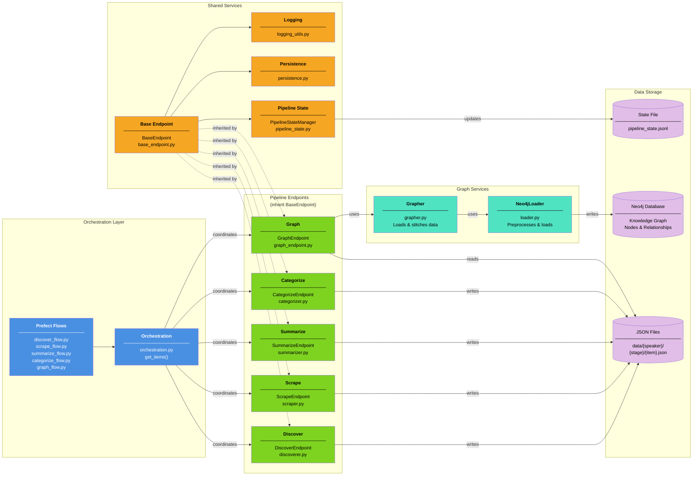
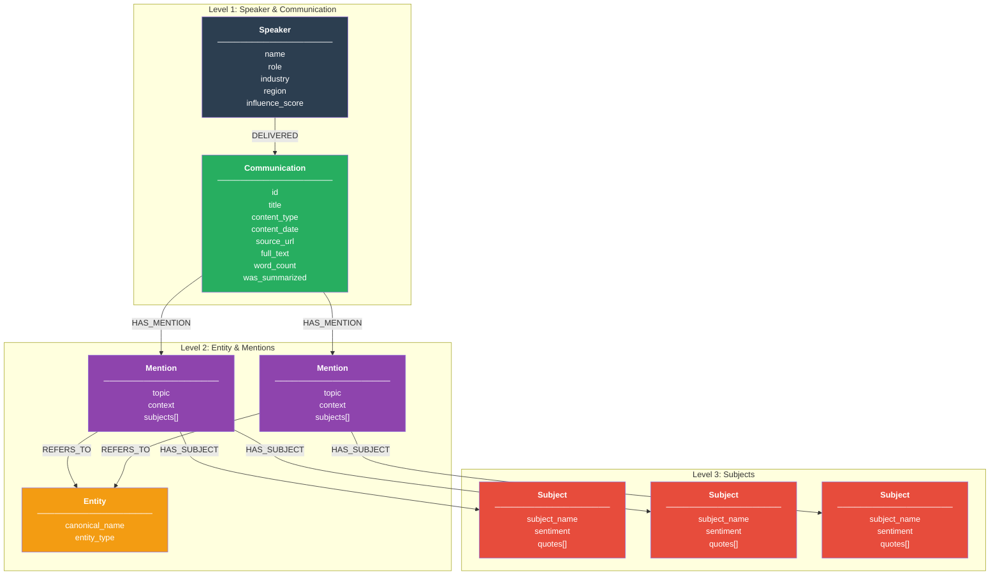

# DiscourseKG System Architecture

## High-Level Overview

DiscourseKG transforms public communications from influential speakers into a knowledge graph. The system processes content through five stages with persistent state tracking for retry logic and incremental updates. Built on Prefect for orchestration and LangChain for LLM analysis, it produces queryable relationship data across speakers, entities, topics, and sentiment.

```mermaid
graph LR
    subgraph INPUT["Input"]
        SPEAKER["<b>Speaker<br/>Communications</b>"]
    end
    
    subgraph STAGES["Processing Pipeline"]
        DISC["<b>1. Discover</b><br/>────────────────────<br/>Find sources"]
        SCRP["<b>2. Scrape</b><br/>────────────────────<br/>Extract transcripts"]
        SUMM["<b>3. Summarize</b><br/>────────────────────<br/>Condense if needed"]
        CAT["<b>4. Categorize</b><br/>────────────────────<br/>Extract entities/topics"]
        GRAPH["<b>5. Graph</b><br/>────────────────────<br/>Load to Neo4j"]
    end
    
    subgraph OUTPUT["Output"]
        KG["<b>Knowledge Graph</b><br/>────────────────────<br/>Queryable relationships"]
    end
    
    SPEAKER -->|"Process"| DISC
    DISC --> SCRP
    SCRP --> SUMM
    SUMM --> CAT
    CAT --> GRAPH
    GRAPH --> KG
    
    style SPEAKER fill:#4A90E2,color:#fff
    style DISC fill:#7ED321,color:#000
    style SCRP fill:#7ED321,color:#000
    style SUMM fill:#7ED321,color:#000
    style CAT fill:#7ED321,color:#000
    style GRAPH fill:#7ED321,color:#000
    style KG fill:#F5A623,color:#000
```

---

## System Architecture

<table>
<tr style="background-color: #fff; color: #000;">
<th>Entity</th>
<th>Job</th>
<th>Why</th>
</tr>
<tr style="background-color: #4A90E2; color: #fff;">
<td><strong>Prefect Flows</strong></td>
<td>Define workflow tasks with dependencies, retries, and error handling</td>
<td>Ensures reliable execution and automatic recovery from failures</td>
</tr>
<tr style="background-color: #4A90E2; color: #fff;">
<td><strong>Orchestration</strong></td>
<td>Queries pipeline state to find items ready for each stage</td>
<td>Coordinates which items move to which stage without manual intervention</td>
</tr>
<tr style="background-color: #7ED321; color: #000;">
<td><strong>Pipeline Endpoints</strong></td>
<td>Execute stage-specific processing logic (find sources, extract text, summarize, categorize, load to Neo4j)</td>
<td>Each stage has unique requirements but shares common execution patterns</td>
</tr>
<tr style="background-color: #50E3C2; color: #000;">
<td><strong>Grapher & Neo4jLoader</strong></td>
<td>Grapher loads and stitches data from multiple stages; Neo4jLoader preprocesses and loads into Neo4j</td>
<td>Separates data assembly from Neo4j operations, enabling clean separation of concerns</td>
</tr>
<tr style="background-color: #F5A623; color: #000;">
<td><strong>BaseEndpoint</strong></td>
<td>Provides standardized `execute()` interface that all endpoints inherit</td>
<td>Ensures consistent behavior across all stages and reduces code duplication</td>
</tr>
<tr style="background-color: #F5A623; color: #000;">
<td><strong>PipelineStateManager</strong></td>
<td>Tracks each item's progress through stages in a JSONL state file</td>
<td>Enables retry logic, failure recovery, and incremental processing without blocking on individual failures</td>
</tr>
<tr style="background-color: #F5A623; color: #000;">
<td><strong>Persistence</strong></td>
<td>Handles file I/O for reading and writing JSON stage outputs</td>
<td>Decouples business logic from file system operations</td>
</tr>
<tr style="background-color: #E1BEE7; color: #000;">
<td><strong>Data Storage</strong></td>
<td>Persists stage outputs (JSON files), tracks pipeline state, and stores knowledge graph in Neo4j</td>
<td>Enables inspection, debugging, resumable processing, and queryable relationship data</td>
</tr>
</table>

---

## Pipeline Flow & State Management

Items progress through five sequential stages: discover (find sources), scrape (extract transcripts), summarize (condense if needed), categorize (extract entities/topics), and graph (load to Neo4j). The `PipelineStateManager` tracks each item's progress in a JSONL file at `data/state/pipeline_state.jsonl`, storing the current stage, completed stages, file paths, and error messages.

```mermaid
graph LR
    subgraph INPUT["Input"]
        PARAMS["<b>Input Parameters</b><br/>────────────────────<br/>speaker: speaker name<br/>start_date: date range start<br/>end_date: date range end"]
    end
    
    subgraph STAGE1["1. Discover"]
        STATE1["<b>PipelineState</b><br/>────────────────────<br/>id: unique identifier<br/>speaker: speaker name<br/>source_url: content URL<br/>content_type: speech/debate/etc<br/>title: content title<br/>content_date: publication date<br/>────────────────────<br/>latest_completed: discover<br/>next_stage: scrape<br/>────────────────────<br/>file_paths: dict<br/>  • discover: output file path"]
        DISCOVER["<b>DiscoverEndpoint</b><br/>────────────────────<br/>execute(params)"]
    end
    
    subgraph STAGE2["2. Scrape"]
        STATE2["<b>PipelineState</b><br/>────────────────────<br/>id: unique identifier<br/>speaker: speaker name<br/>source_url: content URL<br/>content_type: speech/debate/etc<br/>title: content title<br/>content_date: publication date<br/>────────────────────<br/>latest_completed: scrape<br/>next_stage: summarize<br/>────────────────────<br/>file_paths: dict<br/>  • discover: output file<br/>  • scrape: output file"]
        SCRAPE["<b>ScrapeEndpoint</b><br/>────────────────────<br/>execute(state)"]
        SCRAPE_OUT["<b>Scrape Output</b><br/>────────────────────<br/>full_text: extracted transcript<br/>word_count: total word count<br/>content_date: publication date"]
    end
    
    subgraph STAGE3["3. Summarize"]
        STATE3["<b>PipelineState</b><br/>────────────────────<br/>id: unique identifier<br/>speaker: speaker name<br/>────────────────────<br/>latest_completed: summarize<br/>next_stage: categorize<br/>────────────────────<br/>file_paths: dict<br/>  • discover: output file<br/>  • scrape: output file<br/>  • summarize: output file"]
        SUMMARIZE["<b>SummarizeEndpoint</b><br/>────────────────────<br/>execute(state)"]
        SUM_OUT["<b>Summarize Output</b><br/>────────────────────<br/>summary: condensed or original text<br/>was_summarized: true if compressed<br/>compression_ratio: size reduction ratio"]
    end
    
    subgraph STAGE4["4. Categorize"]
        STATE4["<b>PipelineState</b><br/>────────────────────<br/>id: unique identifier<br/>────────────────────<br/>latest_completed: categorize<br/>next_stage: graph<br/>────────────────────<br/>file_paths: dict<br/>  • discover: output file<br/>  • scrape: output file<br/>  • summarize: output file<br/>  • categorize: output file"]
        CATEGORIZE["<b>CategorizeEndpoint</b><br/>────────────────────<br/>execute(state)"]
        CAT_OUT["<b>CategorizationOutput</b><br/>────────────────────<br/>entities: list of entity mentions<br/>  • entity_name: canonical name<br/>  • entity_type: organization/person/etc<br/>  • topics: list of topic mentions"]
    end
    
    subgraph STAGE5["5. Graph"]
        STATE5["<b>PipelineState</b><br/>────────────────────<br/>id: unique identifier<br/>────────────────────<br/>latest_completed: graph<br/>next_stage: null (complete)<br/>────────────────────<br/>file_paths: dict<br/>  • discover: output file<br/>  • scrape: output file<br/>  • summarize: output file<br/>  • categorize: output file"]
        GRAPH["<b>GraphEndpoint</b><br/>────────────────────<br/>execute(state)"]
        GRAPHER["<b>Grapher</b><br/>────────────────────<br/>grapher.py<br/>Loads & stitches data"]
        NEO4J_LOADER["<b>Neo4jLoader</b><br/>────────────────────<br/>loader.py<br/>Preprocesses & loads"]
        NEO4J[("Neo4j Database<br/>────────────────────<br/>Nodes & Relationships")]
    end
    
    PARAMS -->|"Input"| DISCOVER
    DISCOVER -->|"Creates"| STATE1
    
    STATE1 -->|"Query: next_stage='scrape'"| SCRAPE
    SCRAPE -->|"Reads scrape file"| SCRAPE_OUT
    SCRAPE -->|"Updates state"| STATE2
    
    STATE2 -->|"Query: next_stage='summarize'"| SUMMARIZE
    SUMMARIZE -->|"Reads scrape file"| SUM_OUT
    SUMMARIZE -->|"Updates state"| STATE3
    
    STATE3 -->|"Query: next_stage='categorize'"| CATEGORIZE
    CATEGORIZE -->|"Reads summarize file"| CAT_OUT
    CATEGORIZE -->|"Updates state"| STATE4
    
    STATE4 -->|"Query: next_stage='graph'"| GRAPH
    GRAPH -->|"Reads categorize/scrape/<br/>summarize files"| GRAPHER
    GRAPHER -->|"Stitches metadata"| NEO4J_LOADER
    NEO4J_LOADER -->|"Loads to Neo4j"| NEO4J
    GRAPH -->|"Updates state"| STATE5
    
    style PARAMS fill:#4A90E2,color:#fff
    style STATE1 fill:#E8F4F8,color:#000
    style STATE2 fill:#E8F4F8,color:#000
    style STATE3 fill:#E8F4F8,color:#000
    style STATE4 fill:#E8F4F8,color:#000
    style STATE5 fill:#E8F4F8,color:#000
    style DISCOVER fill:#7ED321,color:#000
    style SCRAPE fill:#7ED321,color:#000
    style SUMMARIZE fill:#7ED321,color:#000
    style CATEGORIZE fill:#7ED321,color:#000
    style GRAPH fill:#7ED321,color:#000
    style GRAPHER fill:#50E3C2,color:#000
    style NEO4J_LOADER fill:#50E3C2,color:#000
    style SCRAPE_OUT fill:#FFF9E6,color:#000
    style SUM_OUT fill:#FFF9E6,color:#000
    style CAT_OUT fill:#FFF9E6,color:#000
    style NEO4J fill:#F5A623,color:#000
```

---

## Knowledge Graph Topology

The categorization stage outputs structured data designed for Neo4j ingestion, following a hierarchical graph structure with 5 node types and 4 relationship types. This topology enables queries like "How does Trump discuss Bitcoin?" or "Show all entities with positive sentiment in Technology topics."

**Relationship Types:**

- `DELIVERED`: Speaker → Communication (who delivered the communication)
- `HAS_MENTION`: Communication → Mention (what entities were discussed in what topics)
- `REFERS_TO`: Mention → Entity (which entity is mentioned)
- `HAS_SUBJECT`: Mention → Subject (specific subjects discussed about the entity)

