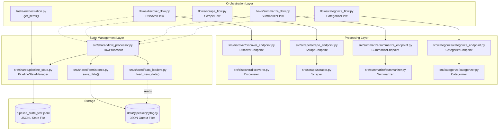
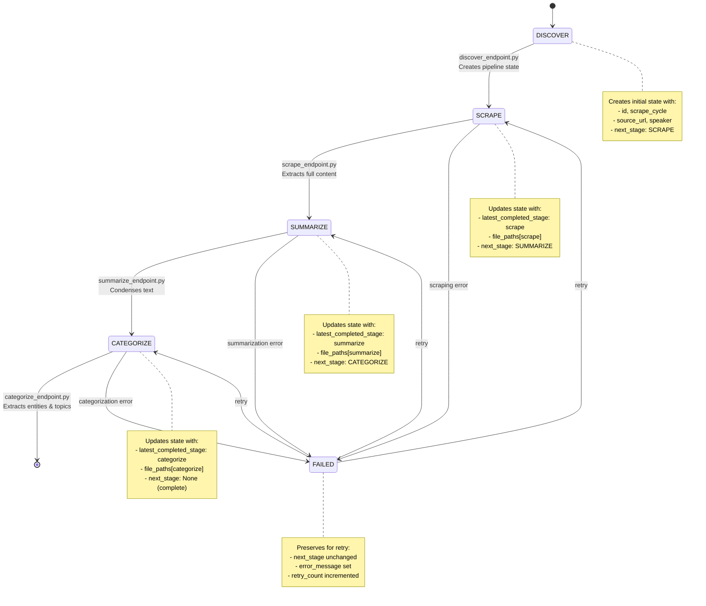
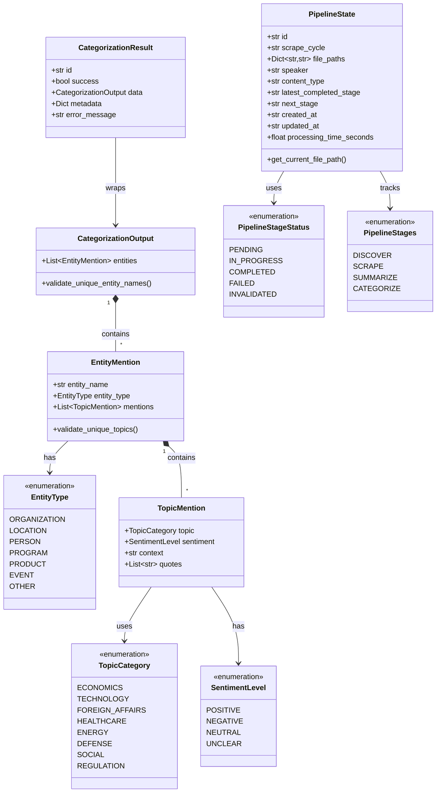

# DiscourseKG Platform Architecture

## High-Level System Overview

DiscourseKG is a state-driven, multi-stage data processing pipeline that transforms public communications into a structured knowledge graph. The system follows a clean separation of concerns with three key layers:

**Orchestration Layer**: Prefect flows coordinate the pipeline execution, managing task dependencies and retry logic.

**Processing Layer**: Stage-specific endpoints and processors handle content discovery, scraping, summarization, and categorization.

**State Management Layer**: A JSONL-based state tracker maintains pipeline progress for each data item, enabling reliable recovery and monitoring.

The architecture uses a **flow-through pattern** where each data item progresses through sequential stages (discover → scrape → summarize → categorize), with state persistence enabling resumable processing and failure recovery.



## Pipeline Flow & State Management

Each discovered item enters the pipeline with a unique ID and progresses through four stages. The `PipelineStateManager` tracks each item's position in the pipeline, storing completed stages and determining what to process next.

**State-Driven Processing**: Flows query the state manager to find items ready for processing (`next_stage` field). After successful processing, the state updates to advance items to the next stage. Failed items remain at their current stage with error details for retry logic.

**Persistence Pattern**: Each stage produces a JSON output file stored in `data/{speaker}/{stage}/{item_id}.json`. The state manager maintains file paths, enabling any stage to load previous outputs without tight coupling between stages.

**Metadata Enrichment**: As items flow through stages, the state record naturally enriches with metadata (speaker, content_type, title, dates) extracted during processing.



## Processing Components

### Endpoint Pattern

Each processing stage implements `BaseEndpoint` with a standardized `execute()` method. Endpoints orchestrate the processing flow:

1. **Load Input Data**: Use `data_loaders.py` to read previous stage output
2. **Execute Processing**: Delegate to stage-specific processor (Discoverer, Scraper, Summarizer, Categorizer)
3. **Return Standardized Response**: Format as `{success, id, stage, output, input_data}`

**Files**: 
- `src/shared/base_endpoint.py` - Abstract base class
- `src/discover/discover_endpoint.py` - Discovery orchestration
- `src/scrape/scrape_endpoint.py` - Scraping orchestration
- `src/summarize/summarize_endpoint.py` - Summarization orchestration
- `src/categorize/categorize_endpoint.py` - Categorization orchestration

### Processor Pattern

Processors contain the core business logic for each stage. They are pure processing units that receive input, transform it, and return results without touching state management or persistence:

- `src/discover/discoverer.py` - Mock discovery (finds sample items for testing)
- `src/scrape/scraper.py` - Mock scraping (simulates content extraction)
- `src/summarize/summarizer.py` - LLM-powered text summarization
- `src/categorize/categorizer.py` - LLM-powered entity extraction and topic categorization

### Flow Processing Pattern

`FlowProcessor` eliminates code duplication across Prefect flows by providing common patterns:

- Load items needing processing via `orchestration.get_items(stage)`
- Execute endpoint for each item with timing
- Save results via `persistence.save_data()`
- Update pipeline state (COMPLETED or FAILED)
- Extract and update metadata naturally

**Files**: 
- `src/shared/flow_processor.py` - Shared processing logic
- `flows/scrape_flow.py`, `flows/summarize_flow.py`, `flows/categorize_flow.py` - Stage-specific flows

### Prefect Task Orchestration

Prefect tasks wrap endpoint execution with retry logic and dependency management:

```python
@task(name="scrape_content", retries=2, retry_delay_seconds=30)
def scrape_content(item: Dict[str, Any]) -> Dict[str, Any]:
    return ScrapeEndpoint().execute(item)
```

Flows coordinate task execution and handle results:

```python
@flow
def scrape_flow():
    FlowProcessor("scrape_flow").process_items(
        stage=PipelineStages.SCRAPE.value,
        task_func=scrape_content,
        data_type="scrape"
    )
```

## Data Models & Relationships

The platform uses Pydantic models for data validation and type safety. Core models fall into three categories: **enums for classification**, **domain models for structured content**, and **result models for stage outputs**.

**Classification Enums** define the taxonomy for categorizing communications:
- `TopicCategory` - Broad topics (economics, technology, foreign affairs, healthcare, etc.)
- `EntityType` - Types of entities mentioned (organization, person, location, program, etc.)
- `SentimentLevel` - Speaker sentiment (positive, negative, neutral, unclear)

**Domain Models** structure the categorization output:
- `TopicMention` - Single mention of an entity within a specific topic (includes sentiment, context, quotes)
- `EntityMention` - Entity with all its topic mentions (enforces unique topics per entity)
- `CategorizationOutput` - Complete categorization result (enforces unique entity names)

**Result Models** wrap stage outputs with success indicators, metadata, and error handling:
- `ScrapingResult`, `SummarizationResult`, `CategorizationResult` - Standardized response format
- All include: `id`, `success`, `data`, `metadata`, `error_message`



## Technology Stack & Design Patterns

### Technology Stack

| Layer | Technology | Purpose |
|-------|-----------|---------|
| **Orchestration** | Prefect 3.x | Workflow management, task scheduling, retry logic |
| **Data Validation** | Pydantic 2.x | Type-safe data models, validation, serialization |
| **LLM Processing** | LangChain + OpenAI | Structured output extraction, summarization, categorization |
| **State Storage** | JSONL Files | Append-only state tracking for resumable pipelines |
| **Data Storage** | JSON Files | Stage output persistence with file-based organization |
| **Language** | Python 3.11+ | Core implementation language |

### Core Design Patterns

**State-Driven Processing**: Items track their own progress through the pipeline, enabling decoupled, resumable processing.

**Endpoint Pattern**: Standardized interface (`BaseEndpoint`) for all processing stages ensures consistent error handling and response formats.

**Flow Processor Pattern**: `FlowProcessor` eliminates code duplication by providing shared patterns for loading items, executing tasks, saving results, and updating state.

**Separation of Concerns**: Clear separation between orchestration (flows), processing logic (processors), and infrastructure (state management, persistence).

**Fail-Fast with Recovery**: Failed items preserve state for retry without blocking pipeline progress for successful items.

## Project Directory Structure

```
DiscourseKG/
├── src/                              # Core application code
│   ├── discover/                     # Discovery stage components
│   │   ├── discover_endpoint.py      # Discovery orchestration
│   │   ├── discoverer.py             # Discovery logic (mock)
│   │   └── pipeline.py               # Discovery pipeline utilities
│   ├── scrape/                       # Scraping stage components
│   │   ├── scrape_endpoint.py        # Scraping orchestration
│   │   ├── scraper.py                # Scraping logic (mock)
│   │   └── pipeline.py               # Scraping pipeline utilities
│   ├── summarize/                    # Summarization stage components
│   │   ├── summarize_endpoint.py     # Summarization orchestration
│   │   ├── summarizer.py             # LLM-powered summarization
│   │   └── pipeline.py               # Summarization pipeline utilities
│   ├── categorize/                   # Categorization stage components
│   │   ├── categorize_endpoint.py    # Categorization orchestration
│   │   ├── categorizer.py            # LLM-powered entity extraction
│   │   └── pipeline.py               # Categorization pipeline utilities
│   ├── shared/                       # Shared infrastructure
│   │   ├── base_endpoint.py          # Abstract endpoint base class
│   │   ├── pipeline_state.py         # State tracking & persistence
│   │   ├── persistence.py            # File-based data storage
│   │   ├── data_loaders.py           # Stage output loading utilities
│   │   └── flow_processor.py         # Shared flow processing patterns
│   ├── utils/                        # Utility functions
│   │   └── logging_utils.py          # Structured logging configuration
│   ├── schemas.py                    # Pydantic data models
│   ├── pipeline_config.py            # Pipeline stage definitions
│   └── app_config.py                 # Application configuration
│
├── flows/                            # Prefect flow definitions
│   ├── discover_flow.py              # Discovery workflow
│   ├── scrape_flow.py                # Scraping workflow
│   ├── summarize_flow.py             # Summarization workflow
│   └── categorize_flow.py            # Categorization workflow
│
├── tasks/                            # Task orchestration utilities
│   └── orchestration.py              # Item retrieval for flows
│
├── tests/                            # Testing utilities
│   ├── transcript_generator.py       # Mock transcript generation
│   └── transcript_templates.json     # Template data for testing
│
├── documentation/                    # Project documentation
│   ├── architecture.md               # System architecture (this file)
│   └── business_requirements_documentation.md  # Business requirements & vision
│
├── data/                             # Data storage (gitignored)
│   ├── {speaker}/                    # Speaker-specific data directories
│   │   ├── discover/                 # Discovery stage outputs
│   │   ├── scrape/                   # Scraping stage outputs
│   │   ├── summarize/                # Summarization stage outputs
│   │   └── categorize/               # Categorization stage outputs
│   └── state/                        # Pipeline state files
│       └── pipeline_state_test.jsonl # JSONL state tracking file
│
├── scripts/                          # Setup and utility scripts
│   └── setup_env.sh                  # Environment setup script
│
├── pyproject.toml                    # Project dependencies & metadata
├── Makefile                          # Common development commands
└── README.md                         # Project overview
```

## Key Architectural Decisions

**JSONL State Storage**: Append-only JSONL format enables simple, reliable state persistence without database overhead. Each line is an independent record, making partial file corruption recoverable.

**File-Based Data Storage**: Stage outputs stored as individual JSON files provide clear audit trails, easy debugging, and simple data inspection without specialized tools.

**Prefect for Orchestration**: Prefect's native support for retries, observability, and task dependencies reduces custom infrastructure code while providing production-grade workflow management.

**LangChain for LLM Processing**: Structured output with Pydantic integration ensures type-safe LLM responses, reducing parsing errors and validation overhead.

**Mock Discovery & Scraping**: Early-stage architecture uses mock implementations to validate pipeline flow before integrating real data sources.

**Metadata Enrichment Strategy**: State records naturally accumulate metadata as items progress through stages, avoiding rigid schema requirements while maintaining queryability.

