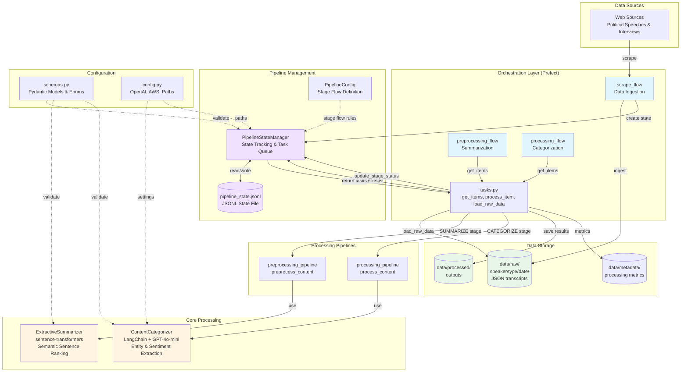
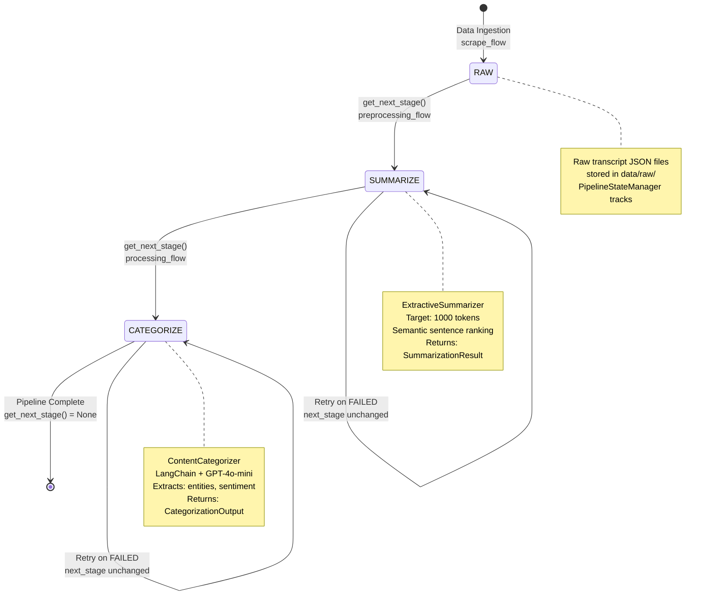
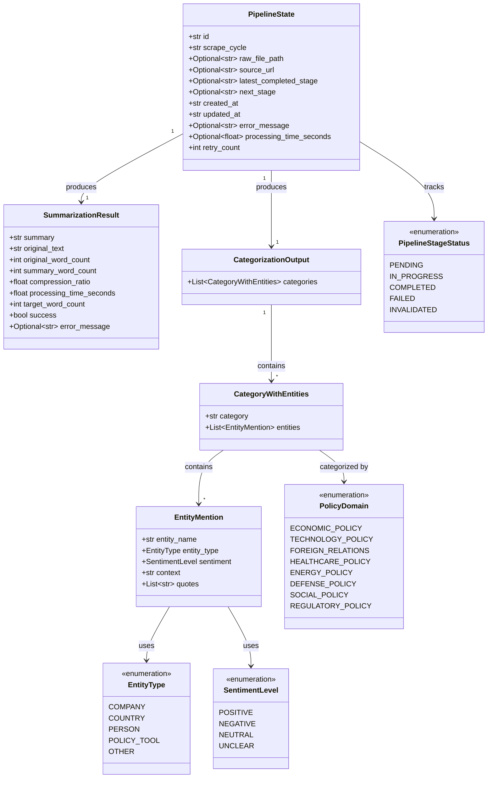
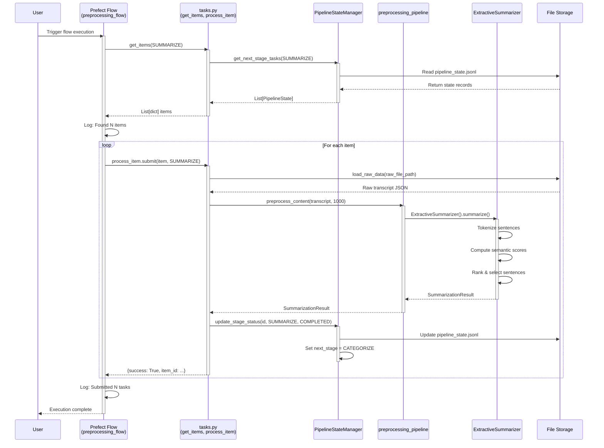

# KG-Sentiment Platform Architecture

*Last Updated: October 12, 2025, 2:45 PM*

Political communication analysis platform using knowledge graphs, sentiment analysis, and automated processing pipelines.

---

## Component Summary

| Component Type | Count | Names |
|---------------|-------|-------|
| **Prefect Flows** | 3 | `preprocessing_flow`, `processing_flow`, `scrape_flow` |
| **Prefect Tasks** | 2 | `process_item`, `scrape_and_ingest` |
| **Pipeline Modules** | 4 | `config`, `pipeline_state`, `preprocessing_pipeline`, `processing_pipeline` |
| **Processing Components** | 2 | `ExtractiveSummarizer`, `ContentCategorizer` |
| **Pydantic Models** | 6 | `PipelineState`, `EntityMention`, `CategoryWithEntities`, `CategorizationOutput`, `SummarizationResult` |
| **Enums** | 4 | `PolicyDomain`, `EntityType`, `SentimentLevel`, `PipelineStageStatus` |

---

## System Architecture



---

## Pipeline Stage Flow



---

## Data Model Class Diagram



---

## Component Interaction Sequence



---

## Component Details

### Flows (Prefect Orchestration)

#### `flows/preprocessing_flow.py`
- **Flow**: `preprocessing_flow()`
- **Purpose**: Orchestrates summarization stage processing
- **Functions**: 
  - Gets items needing summarization via `get_items(SUMMARIZE)`
  - Submits parallel tasks via `process_item.submit()`
- **Dependencies**: `tasks.py`, `pipeline.config`, `logging_utils`

#### `flows/processing_flow.py`
- **Flow**: `processing_flow()`
- **Purpose**: Orchestrates categorization stage processing
- **Functions**:
  - Gets items needing categorization via `get_items(CATEGORIZE)`
  - Submits parallel tasks via `process_item.submit()`
- **Dependencies**: `tasks.py`, `pipeline.config`, `logging_utils`

#### `flows/scrape_flow.py`
- **Flow**: `scrape_flow(speaker, start_date, end_date)`
- **Purpose**: Data ingestion from web sources (currently placeholder)
- **Task**: `scrape_and_ingest(url, speaker)` - future implementation
- **Functions**:
  - URL deduplication via `PipelineStateManager.get_by_source_url()`
  - Creates pipeline state entries
- **Dependencies**: `PipelineStateManager`, `logging_utils`

#### `flows/tasks.py`
- **Functions**:
  - `get_items(stage)` - Query pipeline state for tasks needing processing
  - `load_raw_data(path)` - Load raw JSON transcripts
- **Task**: `process_item(item, stage)` - Process one item through a pipeline stage
  - Routes to appropriate pipeline function based on stage
  - Updates pipeline state on completion/failure
- **Dependencies**: All pipeline modules, schemas

### Pipeline Modules

#### `pipeline/config.py`
- **Classes**:
  - `PipelineStages` - Stage name constants (RAW, SUMMARIZE, CATEGORIZE)
  - `PipelineConfig` - Stage flow configuration and transitions
- **Key Methods**:
  - `get_next_stage(current_stage)` - Returns next stage in pipeline
  - `is_pipeline_complete(next_stage)` - Checks if pipeline is done

#### `pipeline/pipeline_state.py`
- **Class**: `PipelineStateManager`
- **Purpose**: JSONL-based state tracking for idempotent processing
- **Key Methods**:
  - `create_state()` - Initialize tracking for new data point
  - `get_next_stage_tasks(stage)` - Query tasks ready for processing
  - `update_stage_status()` - Update completion/failure status
  - `get_by_source_url()` - Deduplication check
  - `get_failed_tasks()` - Query failed items for retry
- **Storage**: `data/state/pipeline_state.jsonl`
- **Dependencies**: `schemas.py`, `config.py`

#### `pipeline/preprocessing_pipeline.py`
- **Function**: `preprocess_content(text, target_tokens)`
- **Purpose**: Wrapper for extractive summarization
- **Returns**: `SummarizationResult`
- **Dependencies**: `ExtractiveSummarizer`

#### `pipeline/processing_pipeline.py`
- **Function**: `process_content(content_data)`
- **Purpose**: Wrapper for content categorization
- **Returns**: `Dict[str, Any]` with categorization results
- **Dependencies**: `ContentCategorizer`

### Processing Components

#### `src/preprocessing/extractive_summarizer.py`
- **Class**: `ExtractiveSummarizer`
- **Purpose**: Semantic extractive summarization for political content
- **Method**: `summarize(text, target_tokens)` → `SummarizationResult`
- **Algorithm**:
  1. Sentence tokenization (NLTK)
  2. Semantic embedding (sentence-transformers: all-MiniLM-L6-v2)
  3. Hybrid scoring (global + local similarity)
  4. Sentence ranking and selection up to token limit
- **Key Features**:
  - Content-based ranking (90% weight on centrality)
  - No position bias
  - Preserves original sentence order in output
- **Dependencies**: `numpy`, `tiktoken`, `sentence-transformers`, `nltk`

#### `src/processing/content_categorizer.py`
- **Class**: `ContentCategorizer`
- **Purpose**: LLM-based entity extraction and sentiment analysis
- **Method**: `categorize_content(content_data)` → `Dict[str, Any]`
- **LLM Stack**:
  - Framework: LangChain
  - Model: GPT-4o-mini (configurable)
  - Parser: Pydantic structured output
- **Extracts**:
  - Entities (people, companies, countries, policy tools)
  - Entity types (via `EntityType` enum)
  - Sentiment per entity (via `SentimentLevel` enum)
  - Policy domains (via `PolicyDomain` enum)
  - Direct quotes from original text
- **Key Features**:
  - Structured output validation via Pydantic
  - Batch processing support
  - Comprehensive logging
- **Dependencies**: `langchain-openai`, `pydantic`, `schemas.py`

### Data Schemas

#### `src/schemas.py`
**Pydantic Models:**
- `PipelineState` - State tracking for data points through pipeline
- `EntityMention` - Single entity with sentiment and quotes
- `CategoryWithEntities` - Policy domain category with entities
- `CategorizationOutput` - Complete categorization result
- `SummarizationResult` - Summarization output with metrics

**Enums:**
- `PolicyDomain` - 8 policy areas (economic, technology, foreign relations, etc.)
- `EntityType` - 5 entity types (company, country, person, policy tool, other)
- `SentimentLevel` - 4 sentiment levels (positive, negative, neutral, unclear)
- `PipelineStageStatus` - 5 stage statuses (pending, in progress, completed, failed, invalidated)

### Configuration

#### `src/config.py`
- **Class**: `Config`
- **OpenAI**: API key, model (gpt-4o-mini), temperature (0.1), max tokens (2000)
- **AWS**: Region, S3 bucket (for future use)
- **Paths**: Data directories (raw, processed, outputs, state)
- **Settings**: Max transcript length (4000 chars), batch size (10)

---

## Technology Stack

| Layer | Technology | Purpose |
|-------|-----------|---------|
| **Orchestration** | Prefect | Workflow orchestration, parallel task execution |
| **LLM Framework** | LangChain | Structured LLM output parsing |
| **LLM Provider** | OpenAI GPT-4o-mini | Entity extraction, sentiment analysis |
| **Embeddings** | sentence-transformers | Semantic sentence similarity (all-MiniLM-L6-v2) |
| **Tokenization** | tiktoken, NLTK | Token counting, sentence segmentation |
| **Validation** | Pydantic | Data validation and serialization |
| **Storage** | File-based | JSON/JSONL for data and state |
| **Logging** | Python logging | Custom structured logging utilities |
| **Environment** | python-dotenv | Configuration management |

---

## Directory Structure

```
KG-Sentiment/
├── flows/                      # Prefect orchestration flows
│   ├── preprocessing_flow.py   # Summarization orchestration
│   ├── processing_flow.py      # Categorization orchestration
│   ├── scrape_flow.py          # Data ingestion (future)
│   └── tasks.py                # Shared task functions
├── pipeline/                   # Pipeline management
│   ├── config.py               # Stage definitions
│   ├── pipeline_state.py       # State tracking (JSONL-based)
│   ├── preprocessing_pipeline.py
│   └── processing_pipeline.py
├── src/                        # Core processing components
│   ├── config.py               # Platform configuration
│   ├── schemas.py              # Pydantic models & enums
│   ├── preprocessing/
│   │   └── extractive_summarizer.py
│   ├── processing/
│   │   └── content_categorizer.py
│   └── utils/
│       └── logging_utils.py
├── data/                       # Data storage
│   ├── raw/                    # Original transcripts (JSON)
│   ├── processed/              # Processing outputs
│   ├── metadata/               # Processing metrics
│   └── state/                  # Pipeline state tracking (JSONL)
├── documentation/              # Architecture docs
├── playground/                 # Interactive notebooks
├── tests/                      # Test files
└── pyproject.toml              # Project dependencies
```

---

## Key Design Patterns

### 1. Pipeline State Machine Pattern
- **Linear progression**: RAW → SUMMARIZE → CATEGORIZE → COMPLETE
- **State tracking**: JSONL-based for idempotency and resumability
- **Failure handling**: Failed items remain at current stage for retry
- **Deduplication**: Source URL tracking prevents duplicate processing

### 2. Orchestration Layer Separation
- **Flows**: High-level orchestration (Prefect)
- **Pipelines**: Orchestrator-agnostic business logic
- **Components**: Reusable processing units
- **Benefits**: Easy to test, swap orchestrators, or run pipelines manually

### 3. Task Queue Pattern
- `PipelineStateManager.get_next_stage_tasks(stage)` acts as task queue
- Flows query for work rather than being pushed tasks
- Enables parallel processing via `task.submit()`
- Idempotent: Can re-run flows safely

### 4. Structured Output Validation
- All processing outputs validated via Pydantic models
- Type safety throughout the pipeline
- Enums enforce valid values for classifications
- Clear data contracts between components

### 5. Error Isolation
- Failures recorded in pipeline state with error messages
- Individual item failures don't block batch processing
- Retry logic preserves failed items in queue
- Comprehensive logging at all levels

### 6. Configuration Management
- Centralized config via `src/config.py`
- Environment variables via `.env` (dotenv)
- No hardcoded secrets or paths
- Easy to configure per environment

---

## Data Flow Summary

1. **Ingestion** (scrape_flow):
   - Web scraping → Raw JSON files
   - Create pipeline state entry
   - Initial stage: RAW, next stage: SUMMARIZE

2. **Summarization** (preprocessing_flow):
   - Query items at SUMMARIZE stage
   - Load raw transcripts
   - Extractive summarization to 1000 tokens
   - Update state: next stage → CATEGORIZE

3. **Categorization** (processing_flow):
   - Query items at CATEGORIZE stage
   - LLM-based entity extraction
   - Sentiment analysis per entity
   - Update state: next stage → None (complete)

4. **State Management**:
   - All stages tracked in `pipeline_state.jsonl`
   - Failures preserved for retry
   - Processing metrics accumulated
   - Audit trail via timestamps

---

*This architecture documentation is auto-generated by analyzing the KG-Sentiment codebase.*  
*To update: Open Cursor AI and say "update architecture"*

