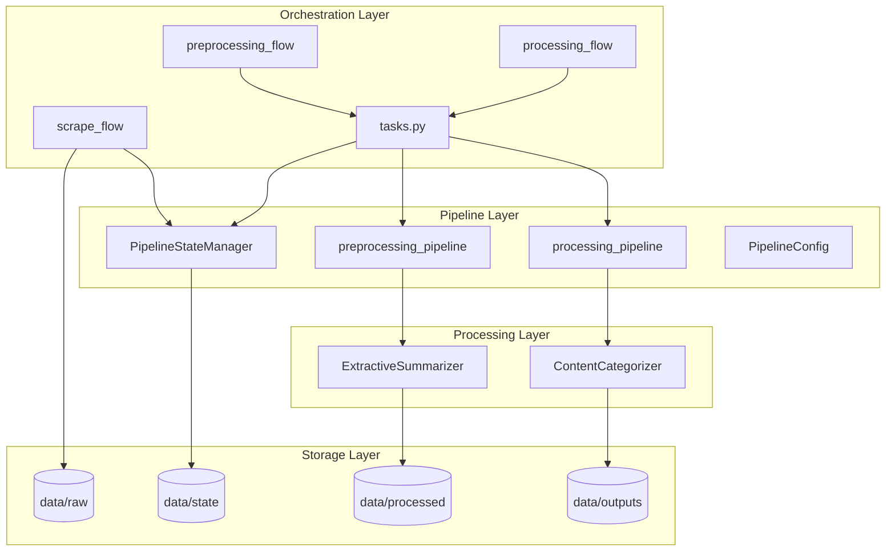
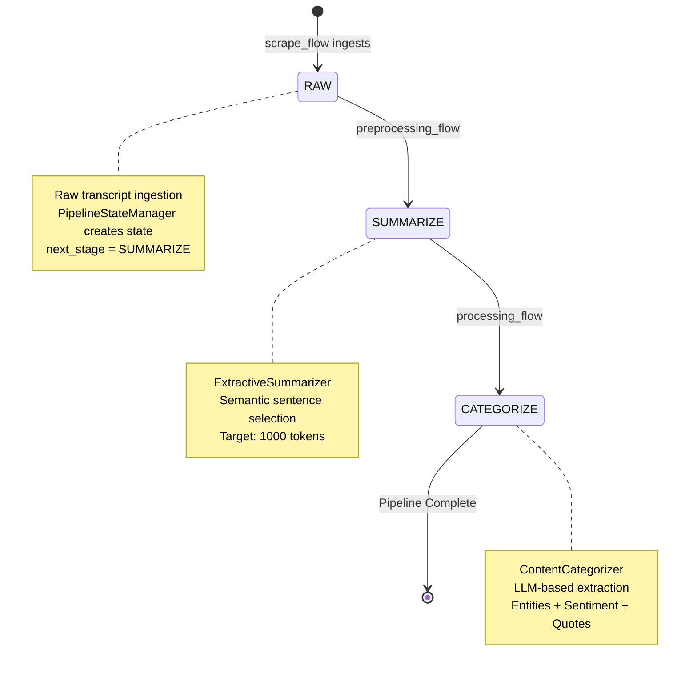
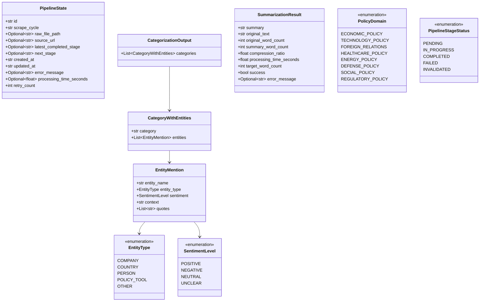
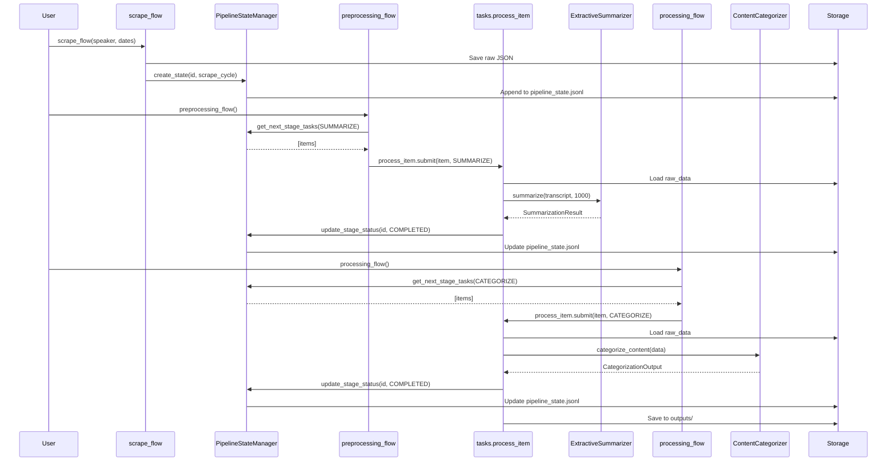

# KG-Sentiment Platform Architecture

**Generated:** 2025-10-12  
**Description:** Political communication analysis pipeline that scrapes, summarizes, categorizes, and extracts entities from speeches and interviews for knowledge graph construction.

---

## Component Summary

| Component Type | Count | Names |
|----------------|-------|-------|
| **Flows** | 3 | `scrape_flow`, `preprocessing_flow`, `processing_flow` |
| **Tasks** | 2 | `get_items`, `process_item` |
| **Pipelines** | 2 | `preprocessing_pipeline`, `processing_pipeline` |
| **Processors** | 2 | `ExtractiveSummarizer`, `ContentCategorizer` |
| **State Managers** | 1 | `PipelineStateManager` |
| **Enums** | 4 | `PolicyDomain`, `EntityType`, `SentimentLevel`, `PipelineStageStatus` |
| **Models** | 5 | `PipelineState`, `EntityMention`, `CategoryWithEntities`, `CategorizationOutput`, `SummarizationResult` |

---

## System Architecture



---

## Pipeline State Flow



---

## Data Model Class Diagram



---

## Sequence Diagram



---

## Data Flow & Integration

### Data Journey Through the System

- **Ingestion**: `scrape_flow` fetches transcripts → saves to `data/raw/{speaker}/{type}/{year}/{month}/{day}/{filename}.json`
- **State Tracking**: Each ingested item gets a `PipelineState` record in `pipeline_state.jsonl` with `next_stage=SUMMARIZE`
- **Stage Routing**: Flows query `PipelineStateManager.get_next_stage_tasks(stage)` to find items ready for processing
- **Preprocessing**: 
  - `preprocessing_flow` → `process_item` task → loads raw JSON → `ExtractiveSummarizer.summarize(transcript, 1000)` 
  - Extractive summarization uses sentence embeddings (SentenceTransformer) to select most relevant sentences
  - Output: `SummarizationResult` with compressed transcript
  - State update: `latest_completed_stage=SUMMARIZE`, `next_stage=CATEGORIZE`
- **Processing**:
  - `processing_flow` → `process_item` task → loads raw JSON → `ContentCategorizer.categorize_content(data)`
  - LLM-based extraction (GPT-4o-mini via LangChain) identifies entities, sentiment, policy domains, quotes
  - Output: `CategorizationOutput` saved to `data/outputs/`
  - State update: `latest_completed_stage=CATEGORIZE`, `next_stage=None` (complete)
- **State Management**: `PipelineStateManager` enables idempotent processing, retry logic, and progress tracking via JSONL append-log
- **Error Handling**: Failed stages preserve `next_stage` for retry, log error message, increment `retry_count`

---

## Technology Stack

| Layer | Technology | Purpose |
|-------|-----------|----------|
| **Orchestration** | Prefect | Flow/task management, scheduling |
| **Data Models** | Pydantic | Type-safe schemas, validation |
| **NLP - Summarization** | SentenceTransformers, NLTK | Semantic embeddings, sentence tokenization |
| **NLP - Categorization** | LangChain, OpenAI | Structured LLM extraction |
| **Tokenization** | tiktoken | Token counting for OpenAI models |
| **Storage** | JSON/JSONL | Raw data, state tracking, outputs |
| **Config** | python-dotenv | Environment variable management |
| **Logging** | Python logging | Structured logging |

---

## Directory Structure

```
KG-Sentiment/
├── flows/                      # Prefect orchestration flows
│   ├── scrape_flow.py         # Data ingestion (future)
│   ├── preprocessing_flow.py  # Summarization orchestration
│   ├── processing_flow.py     # Categorization orchestration
│   └── tasks.py               # Shared Prefect tasks
├── pipeline/                   # Pipeline configuration & state
│   ├── config.py              # Stage definitions and flow
│   ├── pipeline_state.py      # State tracking manager
│   ├── preprocessing_pipeline.py  # Summarization wrapper
│   └── processing_pipeline.py     # Categorization wrapper
├── src/
│   ├── config.py              # Global configuration
│   ├── schemas.py             # Pydantic models & enums
│   ├── preprocessing/
│   │   └── extractive_summarizer.py  # Sentence selection logic
│   ├── processing/
│   │   └── content_categorizer.py    # LLM-based entity extraction
│   ├── data_collection/
│   │   └── scrapers/          # Future web scraping agents
│   └── utils/
│       └── logging_utils.py   # Logger setup
├── data/
│   ├── raw/                   # Ingested transcripts
│   ├── processed/             # Intermediate results
│   ├── outputs/               # Final categorized data
│   ├── state/                 # Pipeline state tracking
│   └── metadata/              # Scrape metadata
├── playground/                # Jupyter notebooks for testing
├── tests/                     # Test utilities
└── documentation/             # Architecture & business requirements
```

---

## Key Design Patterns

1. **State Machine Pattern**: `PipelineConfig` defines stage transitions (RAW→SUMMARIZE→CATEGORIZE→None), enabling linear processing flow
2. **Append-Only Log**: `pipeline_state.jsonl` uses JSONL format for immutable audit trail, updated via rewrite-on-modify
3. **Command Pattern**: Prefect tasks (`process_item`) encapsulate stage processing logic, enable async execution
4. **Strategy Pattern**: Pipeline functions (`preprocess_content`, `process_content`) abstract processor implementations
5. **Repository Pattern**: `PipelineStateManager` centralizes state queries and mutations, hides storage details

---

## Data Flow Summary

- **RAW Stage**: Web scraping → structured JSON → `data/raw/` → create `PipelineState`
- **SUMMARIZE Stage**: Load raw → extractive summarization → `SummarizationResult` → update state
- **CATEGORIZE Stage**: Load raw → LLM entity extraction → `CategorizationOutput` → save to outputs → complete pipeline
- **State Tracking**: `PipelineStateManager` maintains `next_stage` pointer, enables idempotent flow execution
- **Retry Logic**: Failed stages preserve `next_stage`, log errors, increment retry counter
- **Deduplication**: `source_url` used to prevent duplicate scrapes

