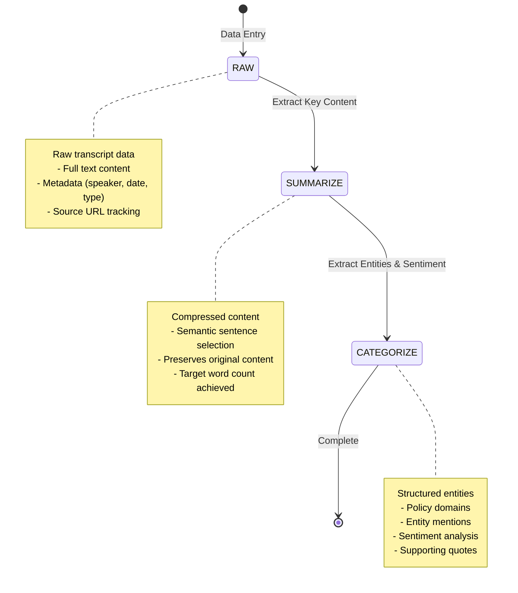
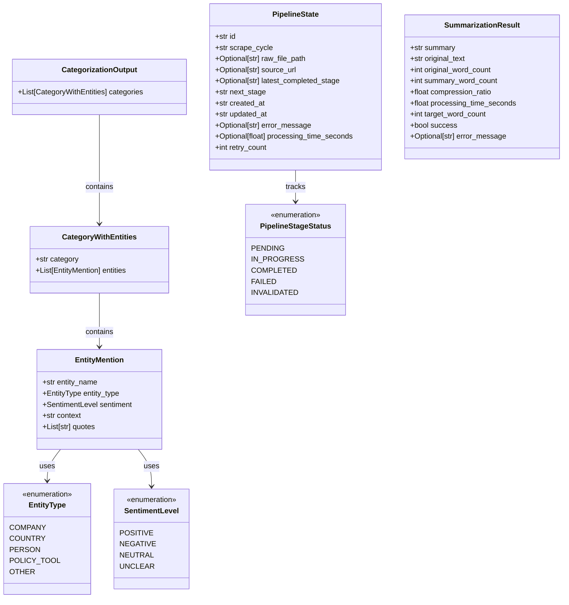
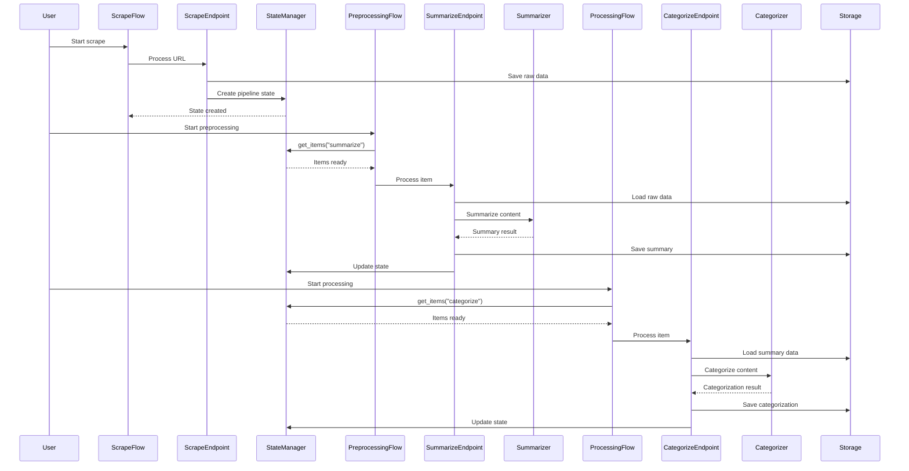

# KG-Sentiment Pipeline Architecture
*Generated: 2025-01-15*

A state-driven, multi-stage data processing pipeline that transforms raw political communications into structured knowledge graph data.

## 1. High-Level Overview

The KG-Sentiment platform is a sophisticated data processing system that transforms raw political communications into structured knowledge graph data through a state-driven, multi-stage architecture.

### Core Pattern
`RAW → SUMMARIZE → CATEGORIZE → Complete`

### Key Design Patterns
- **State-Driven Processing**: `PipelineStateManager` tracks every item through pipeline stages
- **Endpoint Pattern**: Each processing stage has a dedicated endpoint for processing
- **Flow Orchestration**: Prefect flows coordinate processing and handle success/failure
- **Separation of Concerns**: Clear boundaries between orchestration, processing, and data management

## 2. Walk Through Each Layer (Top to Bottom)

### 1. Orchestration Level (`tasks/orchestration.py`)
**How it queries state and determines work**
- **Traffic Controller**: Queries `PipelineStateManager` for items ready for specific stages
- **Single Source of Truth**: Determines what work needs to be done
- **Key Function**: `get_items(stage)` returns items ready for processing

### 2. Flow Level (Prefect Flows)
**How they coordinate processing (scrape, preprocessing, processing)**
- **Scrape Flow** (`flows/scrape_flow.py`): Entry point for new data, generates mock URLs, creates initial pipeline state
- **Preprocessing Flow** (`flows/preprocessing_flow.py`): Gets items ready for summarization, processes through `SummarizeEndpoint`
- **Processing Flow** (`flows/processing_flow.py`): Gets items ready for categorization, processes through `CategorizeEndpoint`

### 3. State Management (`src/shared/pipeline_state.py`)
**How `PipelineStateManager` tracks items through stages**
- **Brain of System**: Tracks every item through pipeline stages
- **Prevents Duplicates**: Checks source URLs to avoid duplicate processing
- **Handles Failures**: Manages retries and error states
- **Auto-Advancement**: Automatically moves items to next stage on success

### 4. Pipeline Configuration (`src/shared/config.py`)
**How stages are defined and flow together**
- **Stage Definitions**: `RAW → SUMMARIZE → CATEGORIZE → Complete`
- **Linear Progression**: Defines what comes after each stage
- **Auto-Advancement**: Enables automatic stage transitions

### 5. Endpoint Level
**How each processing stage has dedicated endpoints**
- **Scrape Endpoint** (`src/collect/scrape_endpoint.py`): Prevents duplicates, generates mock data, saves raw JSON, creates pipeline state
- **Summarize Endpoint** (`src/preprocessing/summarize_endpoint.py`): Loads raw data, validates content, calls `ExtractiveSummarizer`
- **Categorize Endpoint** (`src/processing/categorize_endpoint.py`): Loads summary data, validates content, calls `ContentCategorizer`

### 6. Data Processing
**How summarization and categorization work**
- **Extractive Summarizer** (`src/preprocessing/extractive_summarizer.py`): Uses semantic similarity to identify important sentences, preserves original content
- **Content Categorizer** (`src/processing/content_categorizer.py`): Uses LLM to extract entities, sentiment, and policy domains, returns structured JSON

### 7. Data Management
**How data is loaded, saved, and validated**
- **Data Loaders** (`tasks/data_loaders.py`): Load and validate data from file system at each stage
- **Persistence** (`tasks/persistence.py`): Save processed data with timestamps and automatic subdirectories
- **Schemas** (`src/schemas.py`): Define structured data models for pipeline state and entity data

### 8. Complete Data Flow
**Step-by-step journey from entry to completion**
1. **Entry**: `scrape_flow()` → `ScrapeEndpoint` → Raw JSON saved → Pipeline state created
2. **Orchestration**: `preprocessing_flow()` → `get_items("summarize")` → Items ready for summarization
3. **Processing**: `SummarizeEndpoint` → `ExtractiveSummarizer` → Summary saved → State updated
4. **Orchestration**: `processing_flow()` → `get_items("categorize")` → Items ready for categorization
5. **Processing**: `CategorizeEndpoint` → `ContentCategorizer` → Categorization saved → State updated
6. **Complete**: Item marked as fully processed

## 3. Visual Elements with Requirements

### System Architecture Diagram (Mermaid)
*Requirements: Group by layer (Orchestration, Pipeline, Processing, Storage), keep clean and readable*

```mermaid
graph TB
    subgraph "Orchestration Layer"
        ORCH[tasks/orchestration.py<br/>get_items()]
    end
    
    subgraph "Flow Layer"
        SCRAPE[flows/scrape_flow.py<br/>Scrape Flow]
        PREPROC[flows/preprocessing_flow.py<br/>Preprocessing Flow]
        PROC[flows/processing_flow.py<br/>Processing Flow]
    end
    
    subgraph "State Management"
        STATE[src/shared/pipeline_state.py<br/>PipelineStateManager]
        CONFIG[src/shared/config.py<br/>PipelineConfig]
    end
    
    subgraph "Processing Layer"
        SCRAPE_EP[src/collect/scrape_endpoint.py<br/>ScrapeEndpoint]
        SUMM_EP[src/preprocessing/summarize_endpoint.py<br/>SummarizeEndpoint]
        CAT_EP[src/processing/categorize_endpoint.py<br/>CategorizeEndpoint]
    end
    
    subgraph "Data Processing"
        SUMMARIZER[src/preprocessing/extractive_summarizer.py<br/>ExtractiveSummarizer]
        CATEGORIZER[src/processing/content_categorizer.py<br/>ContentCategorizer]
    end
    
    subgraph "Storage Layer"
        LOADERS[tasks/data_loaders.py<br/>Data Loaders]
        PERSIST[tasks/persistence.py<br/>Persistence]
        SCHEMAS[src/schemas.py<br/>Data Schemas]
    end
    
    ORCH --> SCRAPE
    ORCH --> PREPROC
    ORCH --> PROC
    
    SCRAPE --> SCRAPE_EP
    PREPROC --> SUMM_EP
    PROC --> CAT_EP
    
    SCRAPE_EP --> SUMMARIZER
    SUMM_EP --> SUMMARIZER
    CAT_EP --> CATEGORIZER
    
    STATE --> ORCH
    CONFIG --> STATE
    
    LOADERS --> SUMM_EP
    LOADERS --> CAT_EP
    PERSIST --> SCRAPE_EP
    PERSIST --> SUMM_EP
    PERSIST --> CAT_EP
```

### Pipeline State Flow Diagram (Mermaid)
*Requirements: Extract stages from pipeline/config.py, add brief notes on each stage*



### Data Model Class Diagram (Mermaid)
*Requirements: Show relationships between models, include key field types*



### Sequence Diagram (Mermaid)
*Requirements: Show User → Flow → Task → Pipeline → Component → Storage flow*



## 4. Supporting Information

### Technology Stack Table
| Layer | Technology | Purpose |
|-------|------------|---------|
| Orchestration | Prefect | Flow orchestration and task management |
| State Management | JSONL files | Pipeline state tracking |
| Data Processing | OpenAI GPT-4o-mini | Content categorization and entity extraction |
| Summarization | SentenceTransformers | Extractive text summarization |
| Data Storage | File system | Raw and processed data persistence |
| Data Validation | Pydantic | Schema validation and type safety |
| Configuration | Python dataclasses | Pipeline configuration management |

### Key Design Patterns
- **State-Driven Processing**: PipelineStateManager tracks every item through stages, enabling reliable processing and failure recovery
- **Endpoint Pattern**: Each processing stage has a dedicated endpoint that handles the work and manages state transitions
- **Flow Orchestration**: Prefect flows coordinate the overall process and handle success/failure scenarios
- **Separation of Concerns**: Clear boundaries between orchestration, processing, and data management layers
- **Data Validation**: Pydantic models ensure data integrity and type safety throughout the pipeline

## 5. Style Guidelines
- Use specific file paths and function names
- Explain the "what" and "how" of each component
- Show relationships between components
