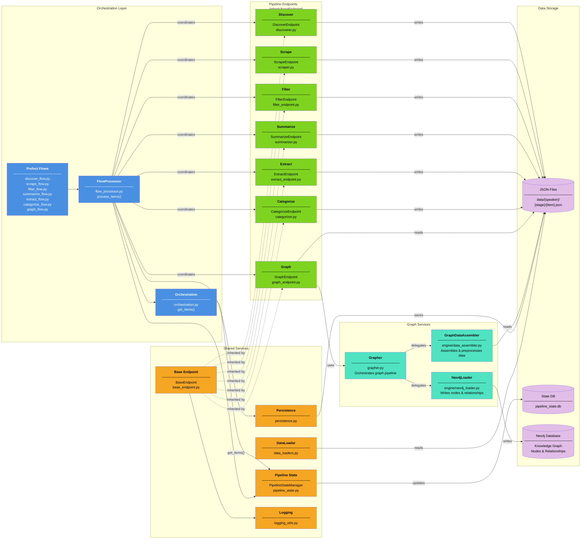
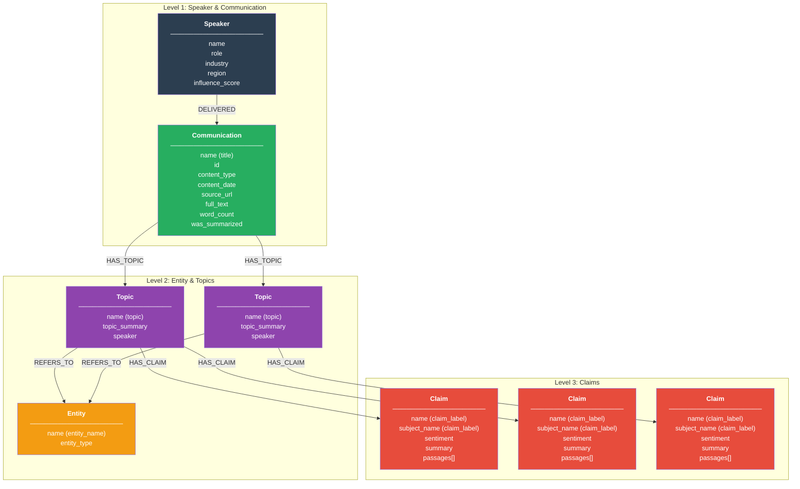

# DiscourseKG System Architecture

## High-Level Overview

DiscourseKG transforms public communications from influential speakers into a queryable knowledge graph. The system processes content through seven sequential stages with persistent state tracking for fault tolerance and incremental updates. Built on Prefect for orchestration, LangChain for LLM analysis, and Neo4j for graph storage, it extracts and maps relationships across speakers, entities, topics, and sentiment.


```mermaid
graph LR
    subgraph INPUT["Input"]
        SPEAKER["<b>Speaker<br/>Communications</b>"]
    end
    
    subgraph STAGES["Processing Pipeline"]
        DISC["<b>1. Discover</b><br/>────────────────────<br/>Find sources"]
        SCRP["<b>2. Scrape</b><br/>────────────────────<br/>Extract text"]
        FILT["<b>3. Filter</b><br/>────────────────────<br/>Classify & filter"]
        SUMM["<b>4. Summarize</b><br/>────────────────────<br/>Condense if needed"]
        EXTR["<b>5. Extract</b><br/>────────────────────<br/>Extract passages"]
        CAT["<b>6. Categorize</b><br/>────────────────────<br/>Extract entities/claims"]
        GRAPH["<b>7. Graph</b><br/>────────────────────<br/>Load to Neo4j"]
    end
    
    subgraph OUTPUT["Output"]
        KG["<b>Knowledge Graph</b><br/>────────────────────<br/>Queryable relationships"]
    end
    
    SPEAKER -->|"Process"| DISC
    DISC --> SCRP
    SCRP --> FILT
    FILT --> SUMM
    SUMM --> EXTR
    EXTR --> CAT
    CAT --> GRAPH
    GRAPH --> KG
    
    style SPEAKER fill:#4A90E2,color:#fff
    style DISC fill:#7ED321,color:#000
    style SCRP fill:#7ED321,color:#000
    style FILT fill:#7ED321,color:#000
    style SUMM fill:#7ED321,color:#000
    style EXTR fill:#7ED321,color:#000
    style CAT fill:#7ED321,color:#000
    style GRAPH fill:#7ED321,color:#000
    style KG fill:#F5A623,color:#000
```

---

## System Architecture

<table>
<tr style="background-color: #fff; color: #000;">
<th>Entity</th>
<th>Job</th>
<th>Why</th>
</tr>
<tr style="background-color: #4A90E2; color: #fff;">
<td><strong>Prefect Flows</strong></td>
<td>Define workflow tasks with dependencies, retries, and error handling via @flow and @task decorators</td>
<td>Ensures reliable execution, automatic recovery from failures, and observable execution history</td>
</tr>
<tr style="background-color: #4A90E2; color: #fff;">
<td><strong>FlowProcessor</strong></td>
<td>Centralizes flow processing patterns (item iteration, error handling, timing, state updates)</td>
<td>Eliminates code duplication across pipeline flows and ensures consistent behavior</td>
</tr>
<tr style="background-color: #4A90E2; color: #fff;">
<td><strong>Orchestration</strong></td>
<td>Queries pipeline state to find items ready for each stage via get_items()</td>
<td>Coordinates which items move to which stage without manual intervention</td>
</tr>
<tr style="background-color: #7ED321; color: #000;">
<td><strong>Pipeline Endpoints</strong></td>
<td>Execute stage-specific processing logic (discover, scrape, filter, summarize, extract, categorize, graph)</td>
<td>Each stage has unique requirements but shares common execution patterns via BaseEndpoint</td>
</tr>
<tr style="background-color: #50E3C2; color: #000;">
<td><strong>Grapher</strong></td>
<td>Orchestrates graph loading by delegating data assembly to GraphDataAssembler and Neo4j writes to Neo4jLoader</td>
<td>Single entry point for the graph pipeline with clean separation of assembly and persistence concerns</td>
</tr>
<tr style="background-color: #50E3C2; color: #000;">
<td><strong>GraphDataAssembler</strong></td>
<td>Loads and stitches data from scrape/filter/summarize/categorize stages; groups flat claims by (speaker, topic); validates entity structure</td>
<td>Separates data preparation from Neo4j write logic</td>
</tr>
<tr style="background-color: #50E3C2; color: #000;">
<td><strong>Neo4jLoader</strong></td>
<td>Handles all Neo4j write operations: constraints, Speaker/Communication/Entity/Topic/Claim nodes and relationships</td>
<td>Isolates Neo4j-specific Cypher queries from data assembly logic</td>
</tr>
<tr style="background-color: #F5A623; color: #000;">
<td><strong>BaseEndpoint</strong></td>
<td>Provides standardized execute() interface and response formatting that all endpoints inherit</td>
<td>Ensures consistent behavior across all stages and reduces code duplication</td>
</tr>
<tr style="background-color: #F5A623; color: #000;">
<td><strong>PipelineStateManager</strong></td>
<td>Tracks each item's progress through stages in a SQLite database with file paths, errors, and retry counts</td>
<td>Enables retry logic, failure recovery, and incremental processing without blocking on individual failures</td>
</tr>
<tr style="background-color: #F5A623; color: #000;">
<td><strong>Persistence</strong></td>
<td>Handles file I/O for saving JSON stage outputs with consistent file path structure</td>
<td>Decouples business logic from file system operations and ensures consistent data organization</td>
</tr>
<tr style="background-color: #F5A623; color: #000;">
<td><strong>DataLoader</strong></td>
<td>Loads JSON data from file paths (supports relative and absolute paths)</td>
<td>Centralizes data loading logic with consistent error handling and path resolution</td>
</tr>
<tr style="background-color: #E1BEE7; color: #000;">
<td><strong>Data Storage</strong></td>
<td>Persists stage outputs (JSON files), tracks pipeline state (SQLite), and stores knowledge graph in Neo4j</td>
<td>Enables inspection, debugging, resumable processing, and queryable relationship data</td>
</tr>
</table>


```mermaid
graph LR
    subgraph ORCH_LAYER["Orchestration Layer"]
        PF["<b>Prefect Flows</b><br/>────────────────────<br/>discover_flow.py<br/>scrape_flow.py<br/>filter_flow.py<br/>summarize_flow.py<br/>extract_flow.py<br/>categorize_flow.py<br/>graph_flow.py"]
        FP["<b>FlowProcessor</b><br/>────────────────────<br/>flow_processor.py<br/>process_items()"]
        ORCH["<b>Orchestration</b><br/>────────────────────<br/>orchestration.py<br/>get_items()"]
    end
    
    subgraph ENDPOINT_LAYER["Pipeline Endpoints<br/>(inherit BaseEndpoint)"]
        DISC["<b>Discover</b><br/>────────────────────<br/>DiscoverEndpoint<br/>discoverer.py"]
        SCRP["<b>Scrape</b><br/>────────────────────<br/>ScrapeEndpoint<br/>scraper.py"]
        FILT["<b>Filter</b><br/>────────────────────<br/>FilterEndpoint<br/>filter_endpoint.py"]
        SUMM["<b>Summarize</b><br/>────────────────────<br/>SummarizeEndpoint<br/>summarizer.py"]
        EXTR["<b>Extract</b><br/>────────────────────<br/>ExtractEndpoint<br/>extract_endpoint.py"]
        CATG["<b>Categorize</b><br/>────────────────────<br/>CategorizeEndpoint<br/>categorizer.py"]
        GRAPH["<b>Graph</b><br/>────────────────────<br/>GraphEndpoint<br/>graph_endpoint.py"]
    end
    
    subgraph SERVICE_LAYER["Shared Services"]
        BASE["<b>Base Endpoint</b><br/>────────────────────<br/>BaseEndpoint<br/>base_endpoint.py"]
        STATE["<b>Pipeline State</b><br/>────────────────────<br/>PipelineStateManager<br/>pipeline_state.py"]
        PERS["<b>Persistence</b><br/>────────────────────<br/>persistence.py"]
        LOADER["<b>DataLoader</b><br/>────────────────────<br/>data_loaders.py"]
        LOG["<b>Logging</b><br/>────────────────────<br/>logging_utils.py"]
    end
    
    subgraph GRAPH_SERVICES["Graph Services"]
        GRAPHER["<b>Grapher</b><br/>────────────────────<br/>grapher.py<br/>Orchestrates graph pipeline"]
        DATA_ASSEMBLER["<b>GraphDataAssembler</b><br/>────────────────────<br/>engine/data_assembler.py<br/>Assembles & preprocesses data"]
        NEO4J_LOADER["<b>Neo4jLoader</b><br/>────────────────────<br/>engine/neo4j_loader.py<br/>Writes nodes & relationships"]
    end
    
    subgraph STORAGE_LAYER["Data Storage"]
        FILES[("JSON Files<br/>────────────────────<br/>data/{speaker}/<br/>{stage}/{item}.json")]
        STFILE[("State DB<br/>────────────────────<br/>pipeline_state.db")]
        NEO4J_DB[("Neo4j Database<br/>────────────────────<br/>Knowledge Graph<br/>Nodes & Relationships")]
    end
    
    PF --> FP
    FP --> ORCH
    ORCH -->|"get_items()"| STATE
    FP -->|"coordinates"| DISC
    FP -->|"coordinates"| SCRP
    FP -->|"coordinates"| FILT
    FP -->|"coordinates"| SUMM
    FP -->|"coordinates"| EXTR
    FP -->|"coordinates"| CATG
    FP -->|"coordinates"| GRAPH
    
    BASE -.->|"inherited by"| DISC
    BASE -.->|"inherited by"| SCRP
    BASE -.->|"inherited by"| FILT
    BASE -.->|"inherited by"| SUMM
    BASE -.->|"inherited by"| EXTR
    BASE -.->|"inherited by"| CATG
    BASE -.->|"inherited by"| GRAPH
    
    BASE --> LOG
    FP --> STATE
    FP --> PERS
    
    DISC -->|"writes"| FILES
    SCRP -->|"writes"| FILES
    FILT -->|"writes"| FILES
    SUMM -->|"writes"| FILES
    EXTR -->|"writes"| FILES
    CATG -->|"writes"| FILES
    GRAPH -->|"reads"| FILES
    GRAPH -->|"uses"| GRAPHER
    GRAPHER -->|"delegates"| DATA_ASSEMBLER
    GRAPHER -->|"delegates"| NEO4J_LOADER
    DATA_ASSEMBLER -->|"reads"| FILES
    NEO4J_LOADER -->|"writes"| NEO4J_DB
    
    STATE -->|"updates"| STFILE
    PERS -->|"saves"| FILES
    LOADER -->|"reads"| FILES
    
    style PF fill:#4A90E2,color:#fff
    style FP fill:#4A90E2,color:#fff
    style ORCH fill:#4A90E2,color:#fff
    style DISC fill:#7ED321,color:#000
    style SCRP fill:#7ED321,color:#000
    style FILT fill:#7ED321,color:#000
    style SUMM fill:#7ED321,color:#000
    style EXTR fill:#7ED321,color:#000
    style CATG fill:#7ED321,color:#000
    style GRAPH fill:#7ED321,color:#000
    style STATE fill:#F5A623,color:#000
    style PERS fill:#F5A623,color:#000
    style BASE fill:#F5A623,color:#000
    style LOADER fill:#F5A623,color:#000
    style LOG fill:#F5A623,color:#000
    style GRAPHER fill:#50E3C2,color:#000
    style DATA_ASSEMBLER fill:#50E3C2,color:#000
    style NEO4J_LOADER fill:#50E3C2,color:#000
    style FILES fill:#E1BEE7,color:#000
    style STFILE fill:#E1BEE7,color:#000
    style NEO4J_DB fill:#E1BEE7,color:#000
```

---

## Pipeline Flow & State Management

Items progress through seven sequential stages: discover (find sources), scrape (extract transcripts), filter (classify content type and filter irrelevant items), summarize (condense if needed), extract (extract entity passages per speaker), categorize (extract entities/claims), and graph (load to Neo4j). Each stage is orchestrated by Prefect flows using the `FlowProcessor` pattern for consistent item handling, error management, and state updates.

The `PipelineStateManager` tracks each item's progress in a SQLite database at `data/pipeline_state.db`, storing:
- Core identifiers (id, run_timestamp, created_at, updated_at)
- Content metadata (title, publication_date, source_url)
- Stage tracking (latest_completed_stage, next_stage)
- Per-stage metadata (file_path, processing_time, retry_count, error_message, custom metadata dict)
- Processing metrics (processing_time_seconds, retry_count)

Flows query the state manager via `get_items(stage)` to find items ready for processing, then use `FlowProcessor.process_items()` to iterate through items with automatic timing, persistence, and state updates. The Filter stage can terminate pipeline processing early with `FILTERED` status for items where no tracked speaker is an active contributor.


```mermaid
graph LR
    subgraph INPUT["Input"]
        PARAMS["<b>Input Parameters</b><br/>────────────────────<br/>speaker: speaker name<br/>start_date: date range start<br/>end_date: date range end"]
    end
    
    subgraph STAGE1["1. Discover"]
        STATE1["<b>PipelineState</b><br/>────────────────────<br/>id: unique identifier<br/>source_url: content URL<br/>title: content title<br/>publication_date: date<br/>────────────────────<br/>latest_completed: discover<br/>next_stage: scrape<br/>────────────────────<br/>stages.discover.file_path: path"]
        DISCOVER["<b>DiscoverEndpoint</b><br/>────────────────────<br/>execute(params)"]
    end
    
    subgraph STAGE2["2. Scrape"]
        STATE2["<b>PipelineState</b><br/>────────────────────<br/>latest_completed: scrape<br/>next_stage: filter<br/>────────────────────<br/>stages.scrape.file_path: path"]
        SCRAPE["<b>ScrapeEndpoint</b><br/>────────────────────<br/>execute(state)"]
        SCRAPE_OUT["<b>ScrapingData</b><br/>────────────────────<br/>scrape: extracted transcript<br/>word_count: total word count<br/>title: content title<br/>content_date: publication date"]
    end
    
    subgraph STAGE3["3. Filter"]
        STATE3["<b>PipelineState</b><br/>────────────────────<br/>latest_completed: filter<br/>next_stage: summarize (or null)<br/>────────────────────<br/>stages.filter.metadata:<br/>  content_type: speech/interview/etc<br/>  matched_speakers: names[]<br/>  active_speakers: names[]"]
        FILTER_EP["<b>FilterEndpoint</b><br/>────────────────────<br/>execute(state)"]
        FILTER_OUT["<b>FilterOutput</b><br/>────────────────────<br/>content_type: speech/interview/etc<br/>active_speakers: names[]<br/>matched_speakers: names[]<br/>is_relevant: true → continue<br/>is_relevant: false → FILTERED"]
    end
    
    subgraph STAGE4["4. Summarize"]
        STATE4["<b>PipelineState</b><br/>────────────────────<br/>latest_completed: summarize<br/>next_stage: extract<br/>────────────────────<br/>stages.summarize.file_path: path"]
        SUMMARIZE["<b>SummarizeEndpoint</b><br/>────────────────────<br/>execute(state)"]
        SUM_OUT["<b>SummarizeOutput</b><br/>────────────────────<br/>summary: condensed or original text<br/>was_summarized: true if compressed<br/>compression_of_original: ratio"]
    end
    
    subgraph STAGE5["5. Extract"]
        STATE5["<b>PipelineState</b><br/>────────────────────<br/>latest_completed: extract<br/>next_stage: categorize<br/>────────────────────<br/>stages.extract.file_path: path"]
        EXTRACT["<b>ExtractEndpoint</b><br/>────────────────────<br/>execute(state)"]
        EXTR_OUT["<b>ExtractionOutput</b><br/>────────────────────<br/>by_speaker:<br/>  speaker → entity → passages[]<br/>entity_whitelist:<br/>  speaker → entity names[]"]
    end
    
    subgraph STAGE6["6. Categorize"]
        STATE6["<b>PipelineState</b><br/>────────────────────<br/>latest_completed: categorize<br/>next_stage: graph<br/>────────────────────<br/>stages.categorize.file_path: path"]
        CATEGORIZE["<b>CategorizeEndpoint</b><br/>────────────────────<br/>execute(state)"]
        CAT_OUT["<b>CategorizationOutput</b><br/>────────────────────<br/>entities: EntityMention[]<br/>  • entity_name, entity_type<br/>  • claims: Claim[]<br/>    - speaker, topic, claim_label<br/>    - sentiment, summary, passages[]"]
    end
    
    subgraph STAGE7["7. Graph"]
        STATE7["<b>PipelineState</b><br/>────────────────────<br/>latest_completed: graph<br/>next_stage: null (complete)"]
        GRAPH["<b>GraphEndpoint</b><br/>────────────────────<br/>execute(state)"]
        GRAPHER["<b>Grapher</b><br/>────────────────────<br/>grapher.py<br/>Assembles & loads to Neo4j"]
        NEO4J[("Neo4j Database<br/>────────────────────<br/>Nodes & Relationships")]
    end
    
    PARAMS -->|"Input"| DISCOVER
    DISCOVER -->|"Creates"| STATE1
    
    STATE1 -->|"Query: next_stage='scrape'"| SCRAPE
    SCRAPE -->|"Extracts transcript"| SCRAPE_OUT
    SCRAPE -->|"Updates state"| STATE2
    
    STATE2 -->|"Query: next_stage='filter'"| FILTER_EP
    FILTER_EP -->|"Classifies content"| FILTER_OUT
    FILTER_EP -->|"Updates state"| STATE3
    
    STATE3 -->|"Query: next_stage='summarize'"| SUMMARIZE
    SUMMARIZE -->|"Condenses text"| SUM_OUT
    SUMMARIZE -->|"Updates state"| STATE4
    
    STATE4 -->|"Query: next_stage='extract'"| EXTRACT
    EXTRACT -->|"Extracts passages"| EXTR_OUT
    EXTRACT -->|"Updates state"| STATE5
    
    STATE5 -->|"Query: next_stage='categorize'"| CATEGORIZE
    CATEGORIZE -->|"Categorizes entities"| CAT_OUT
    CATEGORIZE -->|"Updates state"| STATE6
    
    STATE6 -->|"Query: next_stage='graph'"| GRAPH
    GRAPH -->|"Reads scrape/summarize/<br/>categorize + filter metadata"| GRAPHER
    GRAPHER -->|"Assembles & loads"| NEO4J
    GRAPH -->|"Updates state"| STATE7
    
    style PARAMS fill:#4A90E2,color:#fff
    style STATE1 fill:#E8F4F8,color:#000
    style STATE2 fill:#E8F4F8,color:#000
    style STATE3 fill:#E8F4F8,color:#000
    style STATE4 fill:#E8F4F8,color:#000
    style STATE5 fill:#E8F4F8,color:#000
    style STATE6 fill:#E8F4F8,color:#000
    style STATE7 fill:#E8F4F8,color:#000
    style DISCOVER fill:#7ED321,color:#000
    style SCRAPE fill:#7ED321,color:#000
    style FILTER_EP fill:#7ED321,color:#000
    style SUMMARIZE fill:#7ED321,color:#000
    style EXTRACT fill:#7ED321,color:#000
    style CATEGORIZE fill:#7ED321,color:#000
    style GRAPH fill:#7ED321,color:#000
    style GRAPHER fill:#50E3C2,color:#000
    style SCRAPE_OUT fill:#FFF9E6,color:#000
    style FILTER_OUT fill:#FFF9E6,color:#000
    style SUM_OUT fill:#FFF9E6,color:#000
    style EXTR_OUT fill:#FFF9E6,color:#000
    style CAT_OUT fill:#FFF9E6,color:#000
    style NEO4J fill:#F5A623,color:#000
```

---

## Key Design Patterns

### FlowProcessor Pattern
Eliminates code duplication across pipeline flows by centralizing common processing logic:
- Item iteration and coordination
- Error handling with automatic state updates on failure
- Timing and performance metrics
- Result persistence via `save_data()`
- Pipeline state updates via `PipelineStateManager`
- Metadata extraction and natural state updates

Each flow (except discover) uses `FlowProcessor.process_items(stage, task_func, data_type)` to process all items for a stage.

### BaseEndpoint Pattern
All pipeline endpoints inherit from `BaseEndpoint` to ensure consistent behavior:
- Standardized `execute(item)` interface
- Consistent response structure with `_create_success_response()`
- Stage-specific logging setup

### StageResult Separation
Endpoints return `StageResult` with separated concerns:
- `artifact`: Data to persist as stage output file (scraped text, filter output, extracted passages, etc.)
- `metadata`: Pipeline state updates only (content_type, matched_speakers, etc.)

This separation ensures file outputs remain clean while allowing natural metadata accumulation in pipeline state.

### Filter Termination Pattern
The Filter stage classifies content type and identifies active/matched speakers using an LLM. If no tracked speaker is an active contributor (`is_relevant=False`), the stage returns `PipelineStageStatus.FILTERED`, terminating the pipeline for that item. Matched speaker names and content type are stored in `stages.filter.metadata` for downstream consumption by Extract and Graph stages.

### Two-Phase Extract Pattern
The Extract stage uses a two-phase approach:
1. **Phase 1 (Entity Attribution)**: LLM identifies which entities each tracked speaker substantively discusses (`SpeakerEntityMap`)
2. **Phase 2 (Passage Extraction)**: For each speaker-entity pair, extracts verbatim transcript passages with surrounding context

Output (`ExtractionOutput`) feeds directly into Categorize as flat passages: `{entity_name, speaker, verbatim}`.

### Context Manager Pattern for Neo4j
`Grapher` uses a context manager for clean resource management:
- Automatic connection establishment on `__enter__`
- Automatic cleanup on `__exit__`
- Prevents connection leaks

`Grapher` delegates to `GraphDataAssembler` (data loading, stitching, claim grouping by topic) and `Neo4jLoader` (all Cypher write operations).

### Error Handling Strategy
Multi-level error handling for resilience:
- **Prefect Task Level**: Automatic retries with exponential backoff (`retries=2, retry_delay_seconds=10`)
- **FlowProcessor Level**: Catches exceptions, stores error context in pipeline state, continues with next items
- **State Tracking**: Failed items keep `next_stage` unchanged for manual retry or debugging
- **Error Context**: Stores `error_message` and stage-level retry counts for debugging and retry optimization

---

## Knowledge Graph Topology

The extract stage produces per-speaker entity passages, which the categorize stage transforms into structured `EntityMention` records with flat `Claim` lists. The graph stage uses `Grapher` (via `GraphDataAssembler`) to load data from multiple stages, stitch communication metadata, group flat claims into `(speaker, topic)` topic nodes, validate structure, and load into Neo4j. The resulting graph follows a hierarchical structure with 5 node types and 4 relationship types, enabling queries like "How does Trump discuss Bitcoin?" or "Show all entities with positive sentiment in Technology topics."

**Node Types:**
- **Speaker**: Influential figures with `speaker_id`, `display_name`, `role`, `organization`, `industry`, `region`
- **Communication**: Speeches, interviews, debates with `title`, `content_type`, `content_date`, `source_url`, `full_text`, `word_count`, `was_summarized`, `compression_ratio`
- **Entity**: Entities (`entity_name`, `entity_type`) mentioned across communications — types: organization, location, person, program, product, event, other
- **Topic**: Entity references within a specific (speaker, topic) context with `topic`, `topic_summary`, `speaker` — topics: economics, immigration, elections, technology, foreign_affairs, healthcare, energy_climate, defense, social, government, legal, media, personnel, sports, other
- **Claim**: Specific claims made about an entity (`claim_label`, `sentiment`, `summary`, `passages[]`) with sentiment: positive, negative, neutral, unclear

All nodes include a `name` property for zero-config visualization in Neo4j Browser and Bloom.


```mermaid
graph TB
    subgraph "Level 1: Speaker & Communication"
        S["<b>Speaker</b><br/>────────────────────<br/>name<br/>role<br/>industry<br/>region<br/>influence_score"]
        C["<b>Communication</b><br/>────────────────────<br/>name (title)<br/>id<br/>content_type<br/>content_date<br/>source_url<br/>full_text<br/>word_count<br/>was_summarized"]
    end
    
    subgraph "Level 2: Entity & Topics"
        E["<b>Entity</b><br/>────────────────────<br/>name (entity_name)<br/>entity_type"]
        M1["<b>Topic</b><br/>────────────────────<br/>name (topic)<br/>topic_summary<br/>speaker"]
        M2["<b>Topic</b><br/>────────────────────<br/>name (topic)<br/>topic_summary<br/>speaker"]
    end
    
    subgraph "Level 3: Claims"
        SU1["<b>Claim</b><br/>────────────────────<br/>name (claim_label)<br/>subject_name (claim_label)<br/>sentiment<br/>summary<br/>passages[]"]
        SU2["<b>Claim</b><br/>────────────────────<br/>name (claim_label)<br/>subject_name (claim_label)<br/>sentiment<br/>summary<br/>passages[]"]
        SU3["<b>Claim</b><br/>────────────────────<br/>name (claim_label)<br/>subject_name (claim_label)<br/>sentiment<br/>summary<br/>passages[]"]
    end
    
    S -->|DELIVERED| C
    C -->|HAS_TOPIC| M1
    C -->|HAS_TOPIC| M2
    M1 -->|REFERS_TO| E
    M2 -->|REFERS_TO| E
    M1 -->|HAS_CLAIM| SU1
    M1 -->|HAS_CLAIM| SU2
    M2 -->|HAS_CLAIM| SU3
    
    style S fill:#2C3E50,color:#fff
    style C fill:#27AE60,color:#fff
    style E fill:#F39C12,color:#fff
    style M1 fill:#8E44AD,color:#fff
    style M2 fill:#8E44AD,color:#fff
    style SU1 fill:#E74C3C,color:#fff
    style SU2 fill:#E74C3C,color:#fff
    style SU3 fill:#E74C3C,color:#fff
```

**Relationship Types:**

- `DELIVERED`: Speaker → Communication (who delivered the communication)
- `HAS_TOPIC`: Communication → Topic (entity discussed in a specific topic by a specific speaker)
- `REFERS_TO`: Topic → Entity (which entity is referenced)
- `HAS_CLAIM`: Topic → Claim (specific claims made about the entity in this topic)

Topic nodes are created per unique `(communication, entity, speaker, topic)` combination. Topic-level sentiment can be computed at query time by aggregating Claim sentiment via Cypher.

---

## Data Flow

### File Organization
```
data/
├── pipeline_state.db               # Pipeline state tracking
├── speakers.json                      # Speaker configuration
└── {speaker}/                         # e.g., "test_speaker"
    ├── discover/
    │   └── {content_type}/
    │       └── {id}.json              # Discovered items with metadata
    ├── scrape/
    │   └── {content_type}/
    │       └── {id}.json              # ScrapingData with scrape text
    ├── filter/
    │   └── {content_type}/
    │       └── {id}.json              # FilterOutput with content_type, matched_speakers
    ├── summarize/
    │   └── {content_type}/
    │       └── {id}.json              # SummarizeOutput with compression metrics
    ├── extract/
    │   └── {content_type}/
    │       └── {id}.json              # ExtractionOutput with by_speaker passages
    ├── categorize/
    │   └── {content_type}/
    │       └── {id}.json              # EntityMention[] with flat Claim[] list
    └── graph/
        └── {content_type}/
            └── {id}.json              # GraphLoadStats (nodes/relationships created)
```

### Stage Data Flow

1. **Discover Stage**: Creates initial pipeline state entries and discover output files
2. **Scrape Stage**: Extracts raw transcript text; saves `ScrapingData` with scrape, word_count, title, content_date
3. **Filter Stage**: LLM classifies content type and identifies active/matched speakers; saves `FilterOutput`; stores content_type and matched_speakers in stage metadata; terminates pipeline with `FILTERED` if no tracked speaker is active
4. **Summarize Stage**: Reads scrape output; conditionally summarizes long content; saves `SummarizeOutput` with compression metrics
5. **Extract Stage**: Reads summarize (or scrape) output; two-phase LLM extraction produces `ExtractionOutput` with verbatim passages per speaker-entity pair
6. **Categorize Stage**: Takes extracted passages as input; LLM extracts structured `EntityMention[]` with flat `Claim[]` (speaker, topic, claim_label, sentiment, summary, passages[])
7. **Graph Stage**: `GraphDataAssembler` stitches scrape (full_text), summarize (compression_ratio), categorize (entities), and filter metadata (content_type); groups flat claims into `(speaker, topic)` Topic nodes; `Neo4jLoader` writes all nodes and relationships to Neo4j

Each stage returns `StageResult` with separated `artifact` (persisted data) and `metadata` (state updates), advancing `next_stage` on success.

---

## Speaker Configuration

Speakers are configured in `data/speakers.json` with attributes that become Speaker node properties:

```json
{
  "name": "donald_trump",
  "display_name": "Donald Trump",
  "role": "US President",
  "organization": "US Government",
  "industry": "Politics",
  "region": "United States"
}
```

The discovery stage uses speaker configuration to find relevant content sources. The filter stage uses speaker display names as hints for LLM-based speaker matching.
