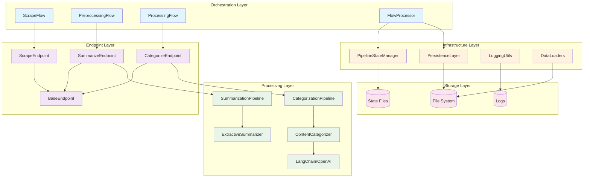
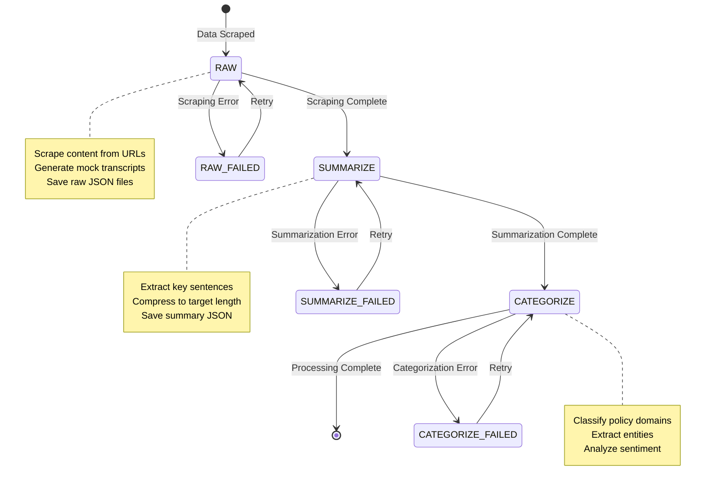
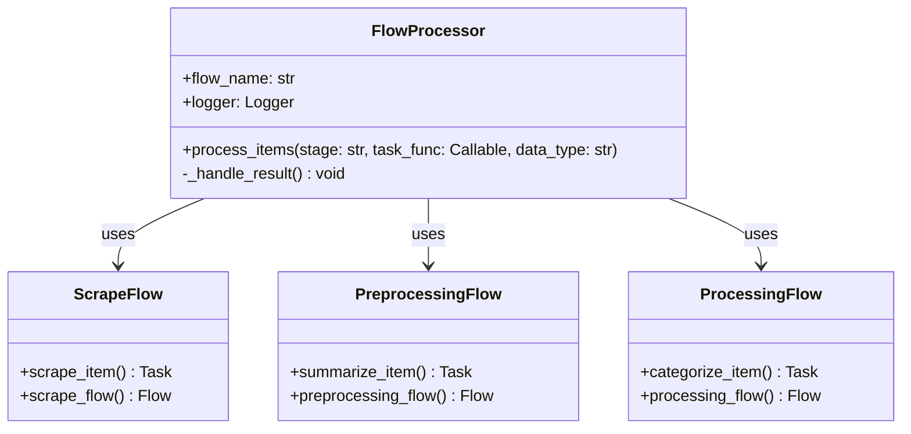
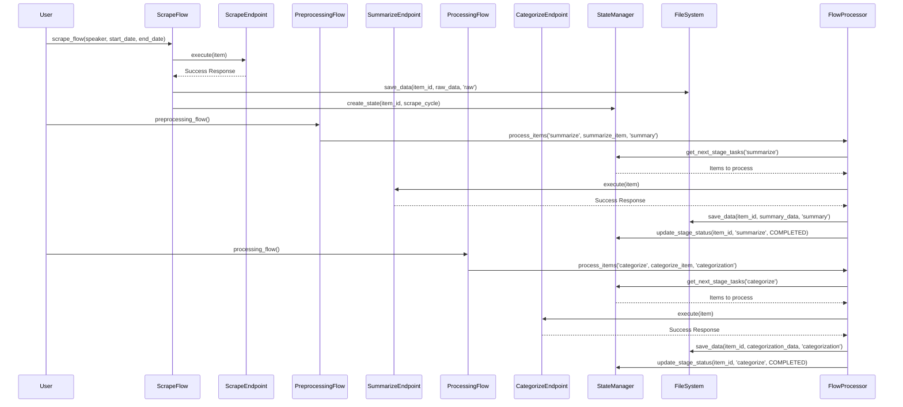

# KG-Sentiment Platform Architecture

## High-Level System Overview

The KG-Sentiment platform is a state-driven, multi-stage data processing pipeline designed for analyzing political communications. The system follows a clean architecture pattern with clear separation of concerns, standardized interfaces, and robust error handling.

The core processing flow follows the pattern: `RAW → SUMMARIZE → CATEGORIZE → Complete`, where each stage is managed through a centralized state system that tracks progress and enables resumable processing.

### Project Directory Structure

```
KG-Sentiment/
├── src/                          # Core application code
│   ├── shared/                   # Shared utilities and base classes
│   │   ├── base_endpoint.py      # Abstract base for all endpoints
│   │   ├── flow_processor.py     # Common flow processing patterns
│   │   ├── logging_utils.py      # Centralized logging setup
│   │   ├── persistence.py        # Data persistence layer
│   │   ├── pipeline_state.py     # State management system
│   │   └── data_loaders.py       # Data loading utilities
│   ├── collect/                  # Data collection layer
│   │   └── scrape_endpoint.py    # Web scraping endpoint
│   ├── preprocessing/            # Data preprocessing layer
│   │   ├── summarize_endpoint.py # Summarization endpoint
│   │   ├── extractive_summarizer.py # Core summarization logic
│   │   └── pipeline.py           # Summarization pipeline
│   ├── processing/               # Content processing layer
│   │   ├── categorize_endpoint.py # Categorization endpoint
│   │   ├── content_categorizer.py # Core categorization logic
│   │   └── pipeline.py           # Categorization pipeline
│   ├── schemas.py                # Pydantic data models
│   ├── pipeline_config.py        # Pipeline stage definitions
│   └── app_config.py             # Application configuration
├── flows/                        # Prefect flow orchestration
│   ├── scrape_flow.py           # Scraping flow orchestration
│   ├── preprocessing_flow.py    # Summarization flow orchestration
│   └── processing_flow.py       # Categorization flow orchestration
├── tasks/                        # Task definitions
│   └── orchestration.py         # Orchestration utilities
├── tests/                        # Test utilities and fixtures
│   ├── test_transcript_generator.py # Mock data generation
│   └── fixtures/                 # Test data fixtures
├── data/                         # Data storage
│   ├── raw/                      # Raw scraped data
│   ├── processed/                # Processed data outputs
│   ├── outputs/                  # Final analysis outputs
│   └── state/                    # Pipeline state files
├── logs/                         # Application logs
└── playground/                   # Interactive testing notebooks
```

### System Architecture Diagram



## Pipeline Flow & State Management

The pipeline operates as a state-driven system where each data item progresses through defined stages. The state manager tracks the current stage, status, and metadata for each item, enabling resumable processing and error recovery.

### Pipeline State Flow Diagram



## Data Models & Relationships

The system uses Pydantic models for type safety and validation. The core models define the structure for political communication analysis, including policy domains, entity extraction, and sentiment analysis.

### Data Model Class Diagram


## Processing Components

The system implements a clean architecture with standardized endpoints that inherit from a common base class. Each endpoint handles a specific stage of the pipeline with consistent error handling and response formatting.

### Endpoint Architecture

All endpoints inherit from `BaseEndpoint` and implement the standardized `execute` method:


### Flow Architecture

The system uses `FlowProcessor` to eliminate code duplication across flows:



## Complete Workflow Example

A typical end-to-end processing flow demonstrates how data moves through the system, from initial scraping through final categorization.

### End-to-End Sequence Diagram



## Technology Stack & Design Patterns

### Technology Stack

| Layer | Technology | Purpose |
|-------|------------|---------|
| **Orchestration** | Prefect | Workflow orchestration and task management |
| **Processing** | Python 3.12+ | Core application logic |
| **AI/ML** | OpenAI GPT-4, LangChain, SentenceTransformers | Content analysis and categorization |
| **Data Validation** | Pydantic | Type safety and data validation |
| **Logging** | Python logging + tqdm | Structured logging with progress bars |
| **Storage** | JSON files | Data persistence and state management |
| **Testing** | Jupyter Notebooks | Interactive testing and validation |

### Design Patterns

- **State Machine Pattern**: Pipeline stages with defined transitions
- **Endpoint Pattern**: Standardized interfaces for all processing stages
- **Template Method Pattern**: BaseEndpoint provides common structure
- **Strategy Pattern**: Different processing strategies per stage
- **Observer Pattern**: State management tracks progress across stages
- **Factory Pattern**: FlowProcessor creates standardized processing flows
- **Singleton Pattern**: Centralized configuration and logging

### Key Architectural Principles

1. **Separation of Concerns**: Clear boundaries between orchestration, processing, and persistence
2. **Standardized Interfaces**: All endpoints follow the same execute() contract
3. **Error Resilience**: Comprehensive error handling with retry mechanisms
4. **State-Driven Processing**: Resumable workflows with progress tracking
5. **Configuration Management**: Centralized configuration with environment variables
6. **Logging Consistency**: Unified logging across all components with module-level loggers
7. **Type Safety**: Pydantic models ensure data integrity throughout the pipeline
8. **Code Deduplication**: FlowProcessor eliminates boilerplate across flows
9. **Serialization at Source**: Pydantic models converted to dicts at creation time

### Recent Architectural Improvements

1. **✅ Standardized Endpoint Architecture**: All endpoints inherit from `BaseEndpoint` with consistent interfaces
2. **✅ FlowProcessor Pattern**: Eliminated code duplication across preprocessing and processing flows
3. **✅ Consolidated Logging**: Single `get_logger()` function with module-level loggers
4. **✅ Pydantic Serialization Fix**: Models converted to dicts at creation time for JSON compatibility
5. **✅ Configuration Cleanup**: Moved implementation-specific constants back to their respective modules
6. **✅ State-Driven Pipeline**: Centralized state management with resumable processing

This architecture provides a robust, scalable foundation for political communication analysis while maintaining clean code principles and operational excellence.
