# DiscourseKG Graph Topology

This document defines the structure of the DiscourseKG knowledge graph - how nodes and relationships are organized to enable market intelligence and relationship discovery.

---

## Overview

The DiscourseKG graph uses a hierarchical structure with 5 node types and 4 relationship types, designed to capture communications from influential speakers and extract actionable intelligence about entities, topics, and sentiment.

**Core Design Principle**: Enable queries like "How does Trump discuss Bitcoin?" or "Show all entities mentioned positively in Technology topics" or "Track sentiment changes for China across multiple communications."

---

## Graph Structure

```mermaid
graph TB
    subgraph "Level 1: Speaker & Communication"
        S[Speaker<br/>___________<br/>name<br/>display_name<br/>role<br/>organization<br/>industry<br/>region<br/>date_of_birth<br/>bio]
        C[Communication<br/>___________<br/>id<br/>title<br/>content_type<br/>content_date<br/>source_url<br/>full_text<br/>word_count<br/>was_summarized<br/>compression_ratio]
    end
    
    subgraph "Level 2: Entity & Mentions"
        E[Entity<br/>___________<br/>canonical_name<br/>entity_type]
        M1[Mention<br/>___________<br/>topic<br/>context<br/>subjects]
        M2[Mention<br/>___________<br/>topic<br/>context<br/>subjects]
    end
    
    subgraph "Level 3: Subjects"
        SU1[Subject<br/>___________<br/>subject_name<br/>sentiment<br/>quotes]
        SU2[Subject<br/>___________<br/>subject_name<br/>sentiment<br/>quotes]
        SU3[Subject<br/>___________<br/>subject_name<br/>sentiment<br/>quotes]
    end
    
    S -->|DELIVERED| C
    C -->|HAS_MENTION| M1
    C -->|HAS_MENTION| M2
    M1 -->|REFERS_TO| E
    M2 -->|REFERS_TO| E
    M1 -->|HAS_SUBJECT| SU1
    M1 -->|HAS_SUBJECT| SU2
    M2 -->|HAS_SUBJECT| SU3
    
    style S fill:#4A90E2,color:#fff
    style C fill:#7ED321,color:#000
    style E fill:#F5A623,color:#000
    style M1 fill:#50E3C2,color:#000
    style M2 fill:#50E3C2,color:#000
    style SU1 fill:#9B59B6,color:#fff
    style SU2 fill:#9B59B6,color:#fff
    style SU3 fill:#9B59B6,color:#fff
```

---

## Node Types

### 1. Speaker
**Represents**: The person who delivered the communication

**Properties**:
- `name` (string, unique): Canonical name (e.g., "Donald Trump", "Joe Biden")
- `display_name` (string): Full formatted name for display purposes
- `role` (string): Position/title (e.g., "President", "CEO", "Senator")
- `organization` (string): Affiliated organization or institution
- `industry` (string): Domain/sector (e.g., "Politics", "Technology", "Finance")
- `region` (string): Geographic location (e.g., "United States", "California")
- `date_of_birth` (date): Speaker's birth date
- `bio` (string): Biographical information about the speaker
- `influence_score` (float, optional): Market-moving power metric (0-100)

**Cardinality**: One per unique speaker
**Example**: Speaker {name: "Donald Trump", display_name: "Donald J. Trump", role: "President", organization: "United States Government", industry: "Politics", region: "United States"}

---

### 2. Communication
**Represents**: A single transcript, speech, interview, or debate

**Properties**:
- `id` (string, unique): Unique identifier from pipeline (e.g., "discovered-item-1-20251026_135658")
- `title` (string): Communication title
- `content_type` (string): Type of communication ("speech", "interview", "debate")
- `content_date` (date): When communication occurred
- `source_url` (string): Original source URL
- `full_text` (string): Complete scraped transcript
- `word_count` (integer): Number of words in full_text
- `was_summarized` (boolean): Whether content was condensed before categorization
- `compression_ratio` (float, optional): Summary length / original length (if summarized)

**Cardinality**: One per transcript/communication
**Source**: Pipeline stages (discover, scrape, summarize)

---

### 3. Entity
**Represents**: A real-world entity mentioned in communications

**Properties**:
- `canonical_name` (string, unique): Standardized entity name (e.g., "Apple", "China", "Bitcoin")
- `entity_type` (enum): Type of entity
  - `organization`: Companies, institutions, government bodies
  - `location`: Countries, regions, cities
  - `person`: Individuals, public figures
  - `program`: Initiatives, policies, projects
  - `product`: Products, services, platforms
  - `event`: Conferences, summits, incidents
  - `other`: Anything else

**Cardinality**: One per unique entity across all communications
**Reusability**: Same entity node referenced by multiple mentions

---

### 4. Mention
**Represents**: A discussion of an entity within a specific topic in a communication

**Properties**:
- `topic` (enum): Topic category where entity was discussed
  - `economics`, `technology`, `foreign_affairs`, `healthcare`, `energy`, `defense`, `social`, `regulation`
- `context` (string): 10-500 char summary of how entity was discussed in this topic
- `subjects` (array): List of specific subjects discussed in this mention

**Cardinality**: One per unique (communication, entity, topic) combination
**Constraint**: An entity can only be mentioned once per topic per communication

**Note**: `aggregated_sentiment` is computed in-memory during the graph loading stage from the `subjects` array before inserting into Neo4j

---

### 5. Subject
**Represents**: A specific 2-3 word subject discussed about an entity

**Properties**:
- `subject_name` (string): 2-3 word description (e.g., "Coal Plants", "Trade Policy", "Job Creation")
- `sentiment` (enum): Speaker's feeling toward this subject
  - `positive`: Supportive, favorable
  - `negative`: Critical, opposing
  - `neutral`: Factual, no emotion
  - `unclear`: Cannot determine
- `quotes` (array of strings): 1-6 verbatim excerpts from full_text about this subject

**Cardinality**: One per distinct subject within a mention
**Granularity**: Enables fine-grained sentiment analysis (e.g., positive on "Regulatory Approval" but negative on "Security Concerns" for same entity)

