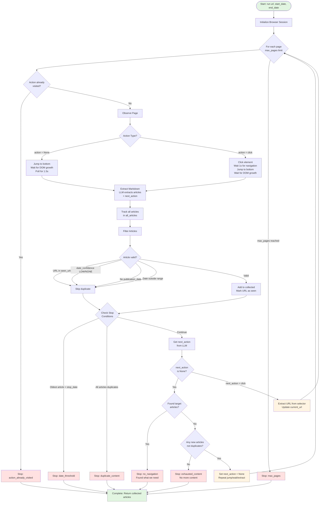

# ScrapingAgent Flow Diagram

## Key Components

### 1. **Page Observation**
- **action = None**: Jump to bottom, wait for DOM growth (infinite scroll preparation)
- **action = click**: Click element, wait for navigation, then jump/wait (pagination)
- **Delta extraction**: On *repeat* (same URL, action=None, not first load), only the new markdown tail is sent to the LLM; first load and after clicks use full markdown.

### 2. **Article Filtering**
Articles must pass all checks:
- Not already seen (deduplication)
- Date confidence HIGH or MEDIUM
- Has publication_date
- Date within start_date to end_date range

### 3. **Navigation Logic**
- **next_action = None**: 
  - If target articles found → Stop
  - If no new articles → Stop (exhausted)
  - If new articles → Repeat jump/wait/extract (infinite scroll)
- **next_action = click**: Navigate to next page

### 4. **Stop Conditions**
1. Action already visited (loop detection)
2. Date threshold (went too far back)
3. Duplicate content (no new articles)
4. No navigation needed (found target articles)
5. Content exhausted (infinite scroll done)
6. Max pages reached
